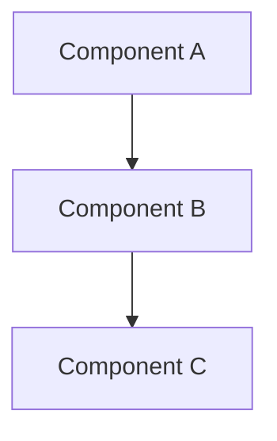

# Design Document: DevSecOps Documentation

## Overview

This design document outlines the structure and content for comprehensive documentation of the DevSecOps platform. The documentation will be created as a single README.md file in the docs/ directory, serving as both a tutorial and reference guide. It will provide users with clear instructions on setting up, configuring, and using the DevSecOps platform, with a focus on practical implementation steps.

## Architecture

The documentation will follow a hierarchical structure with clear sections and subsections. It will be designed to be:

1. **Progressive** - Starting with basic concepts and gradually introducing more complex topics
2. **Modular** - Allowing users to focus on specific sections based on their needs
3. **Visual** - Including placeholders for screenshots and diagrams to enhance understanding
4. **Practical** - Providing concrete examples and code snippets for implementation

The documentation will be implemented as a single Markdown file to ensure ease of navigation and readability both on GitHub and when rendered locally.

## Components and Interfaces

### Documentation Structure

```
README.md
├── 1. Introduction
│   ├── 1.1 Project Overview
│   ├── 1.2 Key Features
│   └── 1.3 Architecture Overview (Mermaid Diagram)
├── 2. Technology Stack
│   ├── 2.1 Comparison and Selection Rationale
│   └── 2.2 Component Integration
├── 3. Installation Guide
│   ├── 3.1 Prerequisites
│   ├── 3.2 Automated Setup
│   └── 3.3 Manual Installation Steps
├── 4. Configuration Guide
│   ├── 4.1 Kubernetes Configuration
│   ├── 4.2 CI/CD Pipeline Setup
│   ├── 4.3 Security Tools Configuration
│   └── 4.4 Monitoring Setup
├── 5. Usage Guide
│   ├── 5.1 Deploying Applications
│   ├── 5.2 Monitoring Security
│   └── 5.3 Viewing Logs and Metrics
├── 6. Integration Guide
│   ├── 6.1 Jenkins and SonarQube Integration
│   ├── 6.2 Git SCM Polling Configuration
│   └── 6.3 Security Tool Integration
├── 7. Troubleshooting
│   ├── 7.1 Common Issues
│   └── 7.2 Debugging Techniques
└── 8. References and Resources
```

### Content Components

1. **Text Content**
   - Explanatory text
   - Step-by-step instructions
   - Configuration guidelines
   - Best practices

2. **Code Snippets**
   - Configuration examples
   - Command-line instructions
   - YAML/JSON configuration samples
   - Script examples

3. **Visual Elements**
   - Mermaid diagrams for architecture visualization
   - Placeholders for screenshots
   - Process flow diagrams

4. **Reference Materials**
   - Links to external documentation
   - References to project files
   - Glossary of terms

## Data Models

### Documentation Sections

Each major section of the documentation will follow this structure:

```
## Section Title

### Introduction/Overview
Brief description of the section's purpose and content.

### Subsection 1
Detailed content including:
- Explanatory text
- Code examples (when applicable)
- Configuration instructions (when applicable)
- Visual elements (when applicable)

### Subsection 2
...

### Key Points Summary
Bullet points summarizing the most important takeaways.
```

### Code Snippet Format

Code snippets will be formatted as follows:

```
File: path/to/file.ext (lines X-Y)
```yaml
key: value
nested:
  subkey: subvalue
```
```

### Diagram Format

Architecture diagrams will use Mermaid syntax:

```

```

## Error Handling

The documentation will include:

1. **Troubleshooting Guides**
   - Common error scenarios
   - Step-by-step resolution procedures
   - Diagnostic commands

2. **Validation Steps**
   - Checkpoints to verify successful implementation
   - Expected outputs and behaviors
   - Testing procedures

3. **Fallback Procedures**
   - Alternative approaches when primary methods fail
   - Manual intervention steps

## Testing Strategy

The documentation will be tested for:

1. **Technical Accuracy**
   - Verification that all commands and configurations work as described
   - Validation of architecture diagrams against actual implementation

2. **Completeness**
   - Coverage of all required topics from requirements
   - Inclusion of all necessary steps for implementation

3. **Usability**
   - Logical flow of information
   - Clear and understandable instructions
   - Appropriate level of detail

4. **Formatting**
   - Proper rendering of Markdown elements
   - Correct display of code blocks and diagrams
   - Consistent styling throughout

## Implementation Details

### Introduction Section

The introduction will provide a high-level overview of the DevSecOps platform, explaining its purpose, benefits, and key components. It will include:

- Project goals and objectives
- DevSecOps principles and benefits
- High-level architecture diagram
- Key features and capabilities

### Technology Stack Section

This section will detail the technologies used in the platform, with explanations of why each was chosen. It will leverage information from the comparaison.md file to provide:

- Comparison tables of alternative technologies
- Rationale for selected components
- Version information and compatibility notes
- Integration points between components

### Installation Guide

The installation guide will provide both automated and manual installation options:

- Prerequisites checklist
- Environment setup instructions
- Step-by-step installation process
- Verification steps

### Configuration Guide

The configuration guide will focus on customizing the platform components:

- Kubernetes configuration options
- CI/CD pipeline setup
- Security tool configuration
- Monitoring system setup
- Credential management

### Usage Guide

The usage guide will provide practical instructions for:

- Deploying applications to the platform
- Monitoring security and compliance
- Viewing logs and metrics
- Managing the CI/CD pipeline

### Integration Guide

This section will focus specifically on integrating the various components:

- Jenkins and SonarQube integration with token setup
- Git SCM polling configuration
- Security tool integration with the CI/CD pipeline
- Monitoring integration

### Troubleshooting

The troubleshooting section will address:

- Common installation issues
- Configuration problems
- Integration challenges
- Performance concerns
- Security alerts

### References and Resources

This section will provide:

- Links to official documentation
- Community resources
- Additional learning materials
- Contact information for support