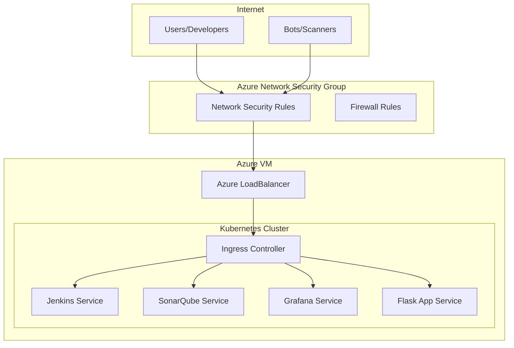

# Azure External Access Configuration Guide

[](https://azure.microsoft.com/)
[](#loadbalancer-services)
[](#security-configuration)
[](https://www.ansible.com/)

This guide provides comprehensive instructions for configuring external access to your DevSecOps stack on Azure Virtual Machines, including security best practices, monitoring setup, and automated deployment.

## 📋 Table of Contents

- [Overview](#overview)
- [Prerequisites](#prerequisites)
- [Azure VM Configuration](#azure-vm-configuration)
- [LoadBalancer Setup](#loadbalancer-setup)
- [Security Configuration](#security-configuration)
- [DNS Configuration](#dns-configuration)
- [SSL/TLS Setup](#ssltls-setup)
- [Monitoring External Access](#monitoring-external-access)
- [Troubleshooting](#troubleshooting)

---

## Overview

### 🎯 What This Configuration Provides

| Service | Internal Access | External Access | Security |
|---------|----------------|-----------------|----------|
| **Flask Application** | `flask-app.local` | `http://<EXTERNAL_IP>` | Public access |
| **Jenkins** | `jenkins.local` | `http://<EXTERNAL_IP>:8080` | Authentication required |
| **SonarQube** | `sonarqube.local` | `http://<EXTERNAL_IP>:9000` | Token-based auth |
| **Grafana** | `grafana.local` | `http://<EXTERNAL_IP>:3000` | User management |

### 🏗️ Architecture Diagram



---

## Prerequisites

### 🔧 Azure VM Requirements

| Requirement | Minimum | Recommended |
|-------------|---------|-------------|
| **VM Size** | Standard_D2s_v3 | Standard_D4s_v3 |
| **OS** | Ubuntu 20.04 LTS | Ubuntu 22.04 LTS |
| **RAM** | 8GB | 16GB |
| **Storage** | 30GB SSD | 50GB Premium SSD |
| **Network** | Standard | Premium |

### 📦 Software Prerequisites

```bash
# Verify prerequisites on Azure VM
az --version                    # Azure CLI
docker --version               # Docker
microk8s version              # MicroK8s
kubectl version --client      # kubectl
```

### 🔑 Azure Permissions Required

- Virtual Machine Contributor
- Network Contributor
- Security Admin (for NSG rules)
- DNS Zone Contributor (if using Azure DNS)

---

## Azure VM Configuration

### 🚀 Initial VM Setup

```bash
# 1. Update system
sudo apt update && sudo apt upgrade -y

# 2. Install required packages
sudo apt install -y curl wget git

# 3. Clone the project
git clone <repository-url>
cd Sample-DevSecOps

# 4. Run the interactive setup
chmod +x setup.sh
./setup.sh
```

### 🌐 Configure External Access

```bash
# Run setup script and choose option 8
./setup.sh

# Select: "8) Configure Azure External Access"
```

The script will automatically:

1. **Detect External IP** - Get your Azure VM's public IP
2. **Create LoadBalancer Services** - Expose services externally
3. **Configure Network Policies** - Set up security rules
4. **Display Access URLs** - Show external endpoints

### 📋 Manual External IP Detection

```bash
# Get external IP using multiple methods
EXTERNAL_IP=$(curl -s ifconfig.me || curl -s ipinfo.io/ip || curl -s icanhazip.com)
echo "Your Azure VM External IP: $EXTERNAL_IP"

# Verify IP from Azure CLI
az vm list-ip-addresses --resource-group <resource-group> --name <vm-name> --output table
```

---

## LoadBalancer Setup

### � Automated LoadBalancer Configuration

The setup script creates LoadBalancer services automatically. Here's what gets configured:

**Jenkins LoadBalancer:**

```yaml
apiVersion: v1
kind: Service
metadata:
  name: jenkins-loadbalancer
  namespace: jenkins
  annotations:
    service.beta.kubernetes.io/azure-load-balancer-internal: "false"
spec:
  type: LoadBalancer
  ports:
  - port: 8080
    targetPort: 8080
    name: http
    protocol: TCP
  selector:
    app.kubernetes.io/component: jenkins-controller
    app.kubernetes.io/instance: jenkins
  sessionAffinity: ClientIP
```

**SonarQube LoadBalancer:**

```yaml
apiVersion: v1
kind: Service
metadata:
  name: sonarqube-loadbalancer
  namespace: sonarqube
  annotations:
    service.beta.kubernetes.io/azure-load-balancer-internal: "false"
spec:
  type: LoadBalancer
  ports:
  - port: 9000
    targetPort: 9000
    name: http
    protocol: TCP
  selector:
    app: sonarqube
    component: sonarqube
  sessionAffinity: ClientIP
```

**Grafana LoadBalancer:**

```yaml
apiVersion: v1
kind: Service
metadata:
  name: grafana-loadbalancer
  namespace: monitoring
  annotations:
    service.beta.kubernetes.io/azure-load-balancer-internal: "false"
spec:
  type: LoadBalancer
  ports:
  - port: 3000
    targetPort: 3000
    name: http
    protocol: TCP
  selector:
    app.kubernetes.io/name: grafana
    app.kubernetes.io/instance: grafana
  sessionAffinity: ClientIP
```

**Flask Application LoadBalancer:**

```yaml
apiVersion: v1
kind: Service
metadata:
  name: flask-app-loadbalancer
  namespace: flask-app
  annotations:
    service.beta.kubernetes.io/azure-load-balancer-internal: "false"
spec:
  type: LoadBalancer
  ports:
  - port: 80
    targetPort: 5000
    name: http
    protocol: TCP
  selector:
    app: flask-app
  sessionAffinity: ClientIP
```

### 🔍 Verify LoadBalancer Status

```bash
# Check LoadBalancer services
kubectl get svc -A | grep LoadBalancer

# Get external IPs assigned
kubectl get svc -A -o wide | grep LoadBalancer

# Check service endpoints
kubectl get endpoints -A | grep -E "(jenkins|sonarqube|grafana|flask-app)"
```
---

## Security Configuration

### 🛡️ Azure Network Security Group (NSG)

**Create NSG Rules for DevSecOps Ports:**

```bash
# Create resource group variables
RESOURCE_GROUP="your-resource-group"
NSG_NAME="your-nsg-name"
LOCATION="your-location"

# Allow HTTP traffic (port 80)
az network nsg rule create \
  --resource-group $RESOURCE_GROUP \
  --nsg-name $NSG_NAME \
  --name "AllowHTTP" \
  --protocol tcp \
  --priority 1000 \
  --destination-port-ranges 80 \
  --access allow \
  --direction inbound

# Allow Jenkins (port 8080)
az network nsg rule create \
  --resource-group $RESOURCE_GROUP \
  --nsg-name $NSG_NAME \
  --name "AllowJenkins" \
  --protocol tcp \
  --priority 1001 \
  --destination-port-ranges 8080 \
  --access allow \
  --direction inbound

# Allow SonarQube (port 9000)
az network nsg rule create \
  --resource-group $RESOURCE_GROUP \
  --nsg-name $NSG_NAME \
  --name "AllowSonarQube" \
  --protocol tcp \
  --priority 1002 \
  --destination-port-ranges 9000 \
  --access allow \
  --direction inbound

# Allow Grafana (port 3000)
az network nsg rule create \
  --resource-group $RESOURCE_GROUP \
  --nsg-name $NSG_NAME \
  --name "AllowGrafana" \
  --protocol tcp \
  --priority 1003 \
  --destination-port-ranges 3000 \
  --access allow \
  --direction inbound

# Allow SSH (port 22) - Restrict to your IP
YOUR_IP=$(curl -s ifconfig.me)
az network nsg rule create \
  --resource-group $RESOURCE_GROUP \
  --nsg-name $NSG_NAME \
  --name "AllowSSH" \
  --protocol tcp \
  --priority 1004 \
  --destination-port-ranges 22 \
  --source-address-prefixes $YOUR_IP \
  --access allow \
  --direction inbound
```

### � Kubernetes Network Policies

**Restrict Internal Communication:**

```yaml
# security/network-policies/deny-all.yaml
apiVersion: networking.k8s.io/v1
kind: NetworkPolicy
metadata:
  name: deny-all-ingress
  namespace: flask-app
spec:
  podSelector: {}
  policyTypes:
  - Ingress
---
apiVersion: networking.k8s.io/v1
kind: NetworkPolicy
metadata:
  name: allow-external-to-flask
  namespace: flask-app
spec:
  podSelector:
    matchLabels:
      app: flask-app
  policyTypes:
  - Ingress
  ingress:
  - from: []  # Allow from anywhere
    ports:
    - protocol: TCP
      port: 5000
```

**Apply Network Policies:**

```bash
# Apply network policies
kubectl apply -f security/network-policies/
```

### 🚨 Security Monitoring

**Configure Azure Security Center:**

```bash
# Enable Azure Security Center (if not already enabled)
az security auto-provisioning-setting update --name default --auto-provision on

# Enable threat detection
az security advanced-threat-protection update \
  --resource-group $RESOURCE_GROUP \
  --resource-type VirtualMachine \
  --resource-name $VM_NAME \
  --is-enabled true
```

---

## DNS Configuration

### 🌐 Option 1: Public DNS (Recommended)

**Configure Azure DNS Zone:**

```bash
# Create DNS zone
az network dns zone create \
  --resource-group $RESOURCE_GROUP \
  --name yourdomain.com

# Add A records for services
EXTERNAL_IP="your-external-ip"

az network dns record-set a add-record \
  --resource-group $RESOURCE_GROUP \
  --zone-name yourdomain.com \
  --record-set-name jenkins \
  --ipv4-address $EXTERNAL_IP

az network dns record-set a add-record \
  --resource-group $RESOURCE_GROUP \
  --zone-name yourdomain.com \
  --record-set-name sonarqube \
  --ipv4-address $EXTERNAL_IP

az network dns record-set a add-record \
  --resource-group $RESOURCE_GROUP \
  --zone-name yourdomain.com \
  --record-set-name grafana \
  --ipv4-address $EXTERNAL_IP

az network dns record-set a add-record \
  --resource-group $RESOURCE_GROUP \
  --zone-name yourdomain.com \
  --record-set-name app \
  --ipv4-address $EXTERNAL_IP
```

### 🏠 Option 2: Local Hosts File

```bash
# Add to /etc/hosts on client machines
echo "# DevSecOps Stack" >> /etc/hosts
echo "$EXTERNAL_IP jenkins.yourdomain.com" >> /etc/hosts
echo "$EXTERNAL_IP sonarqube.yourdomain.com" >> /etc/hosts
echo "$EXTERNAL_IP grafana.yourdomain.com" >> /etc/hosts
echo "$EXTERNAL_IP app.yourdomain.com" >> /etc/hosts
```

---

## SSL/TLS Setup

### 🔐 Let's Encrypt with Cert-Manager

**Install Cert-Manager:**

```bash
# Add cert-manager repository
microk8s helm3 repo add jetstack https://charts.jetstack.io
microk8s helm3 repo update

# Install cert-manager
microk8s helm3 install cert-manager jetstack/cert-manager \
  --namespace cert-manager \
  --create-namespace \
  --set installCRDs=true
```

**Configure ClusterIssuer:**

```yaml
# security/tls/cluster-issuer.yaml
apiVersion: cert-manager.io/v1
kind: ClusterIssuer
metadata:
  name: letsencrypt-prod
spec:
  acme:
    server: https://acme-v02.api.letsencrypt.org/directory
    email: your-email@domain.com
    privateKeySecretRef:
      name: letsencrypt-prod
    solvers:
    - http01:
        ingress:
          class: public
```

**Update Ingress for TLS:**

```yaml
# k8s/ingress-tls.yaml
apiVersion: networking.k8s.io/v1
kind: Ingress
metadata:
  name: flask-app-ingress-tls
  namespace: flask-app
  annotations:
    kubernetes.io/ingress.class: public
    cert-manager.io/cluster-issuer: letsencrypt-prod
    nginx.ingress.kubernetes.io/ssl-redirect: "true"
spec:
  tls:
  - hosts:
    - app.yourdomain.com
    secretName: flask-app-tls
  rules:
  - host: app.yourdomain.com
    http:
      paths:
      - path: /
        pathType: Prefix
        backend:
          service:
            name: flask-app
            port:
              number: 80
```

---

## Monitoring External Access

### 📊 Access Monitoring Dashboard

Configure alerts and monitoring for external access patterns, security threats, and performance metrics through the integrated Grafana dashboards.

**Access URLs After Configuration:**

| Service | External URL | Credentials |
|---------|-------------|-------------|
| **Flask App** | `http://<EXTERNAL_IP>` | No authentication |
| **Jenkins** | `http://<EXTERNAL_IP>:8080` | admin / (from setup) |
| **SonarQube** | `http://<EXTERNAL_IP>:9000` | admin / admin |
| **Grafana** | `http://<EXTERNAL_IP>:3000` | admin / admin123 |

---

## Troubleshooting

### ❗ Common Issues

**Issue 1: Services Not Accessible Externally**

```bash
# Diagnosis steps
kubectl get svc -A | grep LoadBalancer
kubectl describe svc jenkins-loadbalancer -n jenkins

# Check NSG rules
az network nsg rule list --resource-group $RESOURCE_GROUP --nsg-name $NSG_NAME --output table

# Verify external IP
curl -I http://$EXTERNAL_IP:8080
```

**Issue 2: LoadBalancer Stuck in Pending**

```bash
# Check cloud provider integration
kubectl describe svc jenkins-loadbalancer -n jenkins

# Verify Azure Load Balancer
az network lb list --resource-group $RESOURCE_GROUP --output table

# Check node readiness
kubectl get nodes -o wide
```

### 🔧 Debugging Commands

```bash
# Network connectivity test
nc -zv $EXTERNAL_IP 8080   # Jenkins
nc -zv $EXTERNAL_IP 9000   # SonarQube
nc -zv $EXTERNAL_IP 3000   # Grafana
nc -zv $EXTERNAL_IP 80     # Flask App

# Load balancer status
kubectl get svc -A -o custom-columns=NAME:.metadata.name,TYPE:.spec.type,EXTERNAL-IP:.status.loadBalancer.ingress[0].ip

# Pod connectivity test
kubectl exec -it <pod-name> -n <namespace> -- wget -qO- http://google.com
```

### � Recovery Procedures

**Reset External Access Configuration:**

```bash
# Remove LoadBalancer services
kubectl delete svc jenkins-loadbalancer -n jenkins
kubectl delete svc sonarqube-loadbalancer -n sonarqube
kubectl delete svc grafana-loadbalancer -n monitoring
kubectl delete svc flask-app-loadbalancer -n flask-app

# Reconfigure using setup script
./setup.sh  # Option 8
```

---

## 📚 Additional Resources

### Azure Documentation
- [Azure Load Balancer Documentation](https://docs.microsoft.com/en-us/azure/load-balancer/)
- [Azure Network Security Groups](https://docs.microsoft.com/en-us/azure/virtual-network/network-security-groups-overview)
- [Azure DNS Documentation](https://docs.microsoft.com/en-us/azure/dns/)

### Security Best Practices
- [Azure Security Best Practices](https://docs.microsoft.com/en-us/azure/security/)
- [Kubernetes Network Policies](https://kubernetes.io/docs/concepts/services-networking/network-policies/)
- [OWASP Security Guidelines](https://owasp.org/www-project-kubernetes-security-testing-guide/)

---

<div align="center">

**🌐 Successfully configured external access to your DevSecOps stack!**

[🐛 Report Access Issue](https://github.com/username/repo/issues) • [🔒 Security Concerns](mailto:security@example.com) • [📖 Main Documentation](README.md)

</div>
