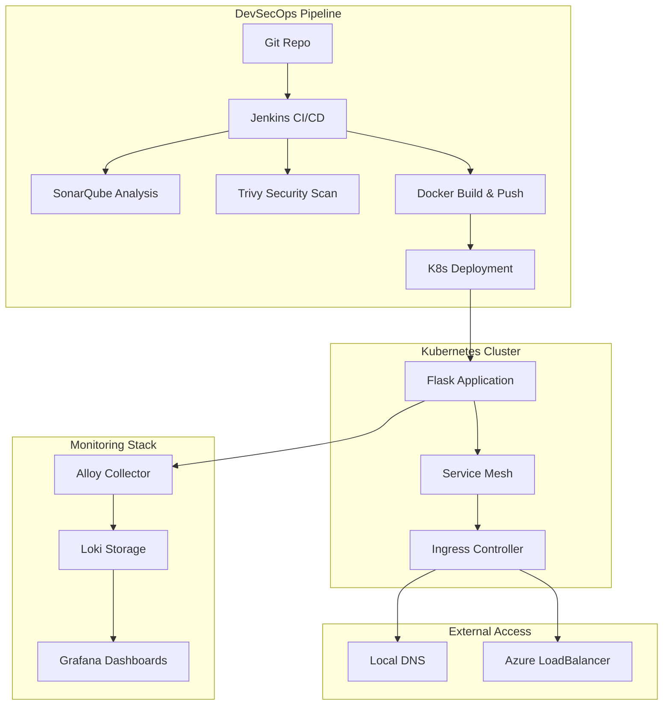

# 🚀 Flask K8s DevSecOps - Complete CI/CD Security Pipeline

[](https://opensource.org/licenses/MIT)
[](https://www.docker.com/)
[](https://kubernetes.io/)
[](https://www.python.org/)

Une solution complète de déploiement sécurisé d'applications Flask sur Kubernetes avec pipeline DevSecOps intégré, monitoring avancé et centralisation des logs.

## 📋 Table des Matières

- [🎯 Vue d'ensemble](#-vue-densemble)
- [🏗️ Architecture](#️-architecture)
- [⚡ Installation Rapide](#-installation-rapide)
- [🧩 Composants](#-composants)
- [🔒 Sécurité](#-sécurité)
- [📊 Monitoring](#-monitoring)
- [🛠️ Développement](#️-développement)
- [☁️ Déploiement Cloud](#️-déploiement-cloud)
- [🔧 Troubleshooting](#-troubleshooting)

## 🎯 Vue d'ensemble

### ✨ Fonctionnalités principales

| Composant | Description | Technologie |
|-----------|-------------|-------------|
| **🐍 Application Flask** | API REST avec métriques et logs structurés | Python 3.9+, Prometheus |
| **🔄 Pipeline DevSecOps** | CI/CD automatisé avec scans sécurisés | Jenkins, SonarQube, Trivy |
| **📦 Orchestration K8s** | Déploiement, scaling et gestion automatique | MicroK8s, Helm Charts |
| **📊 Monitoring Complet** | Logs centralisés et dashboards temps réel | Loki, Grafana, Alloy |
| **🔐 Sécurité Intégrée** | Scans vulnérabilités et qualité code | Trivy, SonarQube |
| **☁️ Cloud Ready** | Support Azure avec accès externe | LoadBalancer, Ingress |

### 🎪 Nouveautés de cette version

- ✅ **Setup interactif** avec menu complet
- ✅ **Installation Docker** automatisée
- ✅ **Support Azure** intégré avec accès externe
- ✅ **Mode développement** Docker Compose standalone
- ✅ **Cleanup intelligent** par composants
- ✅ **Logs colorés** et traçabilité complète
- ✅ **Multi-environnements** (dev, staging, prod)

## 🏗️ Architecture



### � Stack Technologique

| Couche | Technologie | Version | Rôle |
|--------|-------------|---------|------|
| **App** | Flask + Gunicorn | 2.3.3 | API REST, métriques |
| **Container** | Docker + BuildKit | 24.0+ | Containerisation |
| **Orchestration** | MicroK8s | 1.30+ | Cluster Kubernetes |
| **Package Manager** | Helm | 3.8+ | Déploiement applications |
| **CI/CD** | Jenkins | 2.452+ | Pipeline automatisé |
| **Security** | SonarQube + Trivy | Latest | Analyse code + vulnérabilités |
| **Monitoring** | Loki + Grafana + Alloy | 3.0+ | Logs + visualisation |
| **Cloud** | Azure LoadBalancer | - | Accès externe |

## ⚡ Installation Rapide

### 🚀 Setup Automatisé (Recommandé)

```bash
# 1. Cloner le projet
git clone <repository-url>
cd Sample-DevSecOps

# 2. Rendre le script exécutable
chmod +x setup.sh

# 3. Lancer le menu interactif
./setup.sh
```

Le menu vous propose les options suivantes :

```
🚀 DevSecOps Setup Menu
======================
  1) Install Docker                    # Installation Docker automatisée
  2) Check Prerequisites              # Vérification prérequis
  3) Setup MicroK8s                   # Configuration cluster K8s
  4) Build Jenkins Image              # Image Jenkins personnalisée
  5) Deploy Core Services             # Jenkins + SonarQube
  6) Deploy Monitoring Stack          # Loki + Grafana + Alloy
  7) Deploy Flask Application         # Application principale
  8) Configure Azure External Access  # Accès cloud
  9) Full Production Setup            # Installation complète (3-7)
 10) Development Mode                 # Docker Compose local
 11) Cleanup Options                  # Nettoyage par composants
 12) Show Access Information          # URLs et credentials
 13) Exit
```

### ⚡ Installation Express (Production)

```bash
./setup.sh
# Choisir option 9 pour l'installation complète
```

### 🧪 Mode Développement Local

```bash
./setup.sh
# Choisir option 10 pour Docker Compose
```

### 📋 Prérequis Système

| Composant | Version Minimum | Recommandé |
|-----------|----------------|------------|
| **OS** | Ubuntu 20.04+ | Ubuntu 22.04 LTS |
| **CPU** | 2 cores | 4+ cores |
| **RAM** | 4GB | 8GB+ |
| **Stockage** | 10GB libre | 20GB+ |
| **Docker** | 20.10+ | 24.0+ |
| **Git** | 2.25+ | Latest |

## 🧩 Composants

### 🐍 Application Flask

**Endpoints disponibles :**

```bash
GET  /                    # Page d'accueil avec statut
GET  /health              # Health check pour K8s
GET  /api/users           # Liste des utilisateurs (JSON)
POST /api/users           # Créer utilisateur
PUT  /api/users/{id}      # Modifier utilisateur
DELETE /api/users/{id}    # Supprimer utilisateur
GET  /metrics             # Métriques Prometheus
GET  /logs                # Interface logs temps réel
```

**Fonctionnalités :**

- ✅ Logs structurés JSON
- ✅ Métriques Prometheus intégrées
- ✅ Health checks Kubernetes
- ✅ Gestion d'erreurs centralisée
- ✅ Rate limiting
- ✅ CORS configuré

### 🔄 Pipeline DevSecOps

**Étapes du pipeline Jenkins :**

1. **📥 Checkout SCM** - Récupération code source
2. **📦 Install Dependencies** - Installation packages Python
3. **🧪 Run Tests** - Tests unitaires avec coverage
4. **📊 SonarQube Analysis** - Analyse qualité code
5. **🔍 Trivy FS Scan** - Scan filesystem vulnérabilités
6. **🐳 Build & Push Image** - Construction image Docker
7. **🛡️ Trivy Image Scan** - Scan image vulnérabilités
8. **🚀 Deploy to K8s** - Déploiement Kubernetes

**Configuration automatique :**

- Intégration SonarQube avec tokens
- Registry Docker local MicroK8s
- Déploiement Rolling Update
- Tests automatisés avec rapports

### 📊 Stack Monitoring

**Composants :**

| Service | Port | Rôle | Configuration |
|---------|------|------|---------------|
| **Loki** | 3100 | Stockage logs | SingleBinary mode |
| **Grafana** | 3000 | Visualisation | Dashboards pré-configurés |
| **Alloy** | - | Collecteur logs | Auto-discovery K8s |

**Dashboards inclus :**

- 📈 **Application Metrics** - Performance temps réel
- 🔒 **Security Dashboard** - Événements sécurité
- 📋 **Infrastructure** - État cluster K8s
- 🚨 **Alerts** - Notifications automatiques

## 🔒 Sécurité

### 🛡️ Scans Automatisés

**SonarQube Analysis :**

```bash
# Configuration dans security/sonarqube/sonar-project.properties
sonar.projectKey=flask-k8s-devsecops
sonar.sources=app/
sonar.language=py
sonar.python.coverage.reportPaths=coverage.xml
```

**Trivy Security Scans :**

```bash
# Scan filesystem
trivy fs ./app --format table --severity HIGH,CRITICAL

# Scan Docker image
trivy image localhost:32000/flask-k8s-app:latest
```

### 🔐 Sécurité Implémentée

| Aspect | Implémentation | Outil |
|--------|----------------|-------|
| **Container Security** | Images non-root, minimal base | Docker |
| **Code Quality** | Analyse statique continue | SonarQube |
| **Vulnerability Scan** | Scan images + filesystem | Trivy |
| **Secrets Management** | Kubernetes secrets chiffrés | K8s |
| **Network Policies** | Isolation réseau pods | K8s NetworkPolicy |
| **RBAC** | Contrôle accès granulaire | K8s RBAC |
| **TLS/SSL** | Chiffrement en transit | Ingress TLS |

### 📊 Dashboard Sécurité

Métriques surveillées :

- 🚫 Tentatives authentification échouées
- ⚠️ Erreurs HTTP suspectes (4xx/5xx)
- 🔍 Patterns d'attaque détectés
- 📈 Anomalies trafic réseau

## 📊 Monitoring

### 🎯 Métriques Application

**Prometheus Metrics :**

```python
# Compteurs requêtes
flask_requests_total{method="GET", endpoint="/api/users", status="200"}

# Latence requêtes
flask_request_duration_seconds{method="POST", endpoint="/api/users"}

# Métriques business
flask_users_created_total
flask_errors_total{error_type="validation"}
```

### 📋 Dashboards Grafana

**1. Application Dashboard :**

- 📊 Taux de requêtes par endpoint
- ⏱️ Latence P95/P99
- 📈 Codes de statut HTTP
- 💾 Utilisation ressources

**2. Security Dashboard :**

- 🔒 Échecs authentification
- 🚨 Alertes sécurité
- 📊 Top user agents suspects
- 🌐 Géolocalisation connexions

**3. Infrastructure Dashboard :**

- 🖥️ Métriques nodes K8s
- 📦 État des pods
- 💾 Utilisation stockage
- 🌐 Trafic réseau

### 🚨 Alertes Configurées

```yaml
# Exemple d'alerte Grafana
- alert: HighErrorRate
  expr: rate(flask_requests_total{status=~"5.."}[5m]) > 0.1
  for: 2m
  annotations:
    summary: "Taux d'erreur élevé détecté"
```

## 🛠️ Développement

### 🧪 Mode Développement Local

```bash
# Démarrer avec Docker Compose
./setup.sh  # Option 10

# Ou manuellement
docker compose up -d

# Vérifier les services
docker compose ps
```

**Services développement :**

| Service | URL | Identifiants |
|---------|-----|--------------|
| Flask App | http://localhost:5000 | - |
| SonarQube | http://localhost:9000 | admin/admin |
| Grafana | http://localhost:3000 | admin/admin123 |
| Loki | http://localhost:3100 | - |

### 🧪 Tests et Qualité

```bash
cd app/

# Tests unitaires
python -m pytest tests/ -v

# Tests avec couverture
python -m pytest tests/ --cov=. --cov-report=html

# Linting
flake8 app.py
black app.py --check

# Tests de charge
pip install locust
locust -f tests/load_test.py --host=http://localhost:5000
```

### 🔧 Développement avec Hot Reload

```bash
# Mode développement Flask
cd app/
FLASK_ENV=development python app.py

# Avec volume Docker
docker run -v $(pwd)/app:/app -p 5000:5000 flask-k8s-app:latest
```

### 📦 Build et Push Images

```bash
# Build local
docker build -t flask-k8s-app:latest ./app

# Tag pour registry
docker tag flask-k8s-app:latest localhost:32000/flask-k8s-app:latest

# Push vers MicroK8s registry
docker push localhost:32000/flask-k8s-app:latest
```

## ☁️ Déploiement Cloud

### 🌩️ Configuration Azure

```bash
# Configurer accès externe Azure
./setup.sh  # Option 8

# Vérifier IP externe
curl -s ifconfig.me
```

**Services LoadBalancer créés :**

| Service | Port Externe | Port Interne |
|---------|--------------|--------------|
| Jenkins | 8080 | 8080 |
| SonarQube | 9000 | 9000 |
| Grafana | 3000 | 3000 |
| Flask App | 80 | 5000 |

### 🔗 URLs Accès Externe

Après configuration Azure :

```bash
# Remplacer <EXTERNAL_IP> par votre IP publique
http://<EXTERNAL_IP>:8080  # Jenkins
http://<EXTERNAL_IP>:9000  # SonarQube  
http://<EXTERNAL_IP>:3000  # Grafana
http://<EXTERNAL_IP>       # Flask App
```

### 🛡️ Sécurité Cloud

**Configuration firewall Azure :**

```bash
# Ouvrir ports nécessaires
az network nsg rule create \
  --resource-group myResourceGroup \
  --nsg-name myNSG \
  --name DevSecOps-Ports \
  --protocol tcp \
  --priority 1000 \
  --destination-port-ranges 80 3000 8080 9000 \
  --access allow
```

### � Monitoring Cloud

- 📈 **Azure Monitor** - Métriques VM
- 🔍 **Application Insights** - APM
- 📋 **Log Analytics** - Centralisation logs
- 🚨 **Azure Alerts** - Notifications

## �🔧 Troubleshooting

### ❗ Problèmes Courants

**1. Pods en état Pending :**

```bash
# Vérifier ressources
kubectl describe pod <pod-name> -n <namespace>
kubectl top nodes
microk8s inspect

# Solution : Augmenter ressources ou nettoyer
./setup.sh  # Option 11 pour cleanup
```

**2. Images Docker non trouvées :**

```bash
# Vérifier registry local
docker images | grep localhost:32000

# Rebuilder si nécessaire
./setup.sh  # Option 4 puis 7
```

**3. Services inaccessibles :**

```bash
# Vérifier ingress
kubectl get ingress -A
kubectl describe ingress -n flask-app

# Vérifier /etc/hosts
grep "\.local" /etc/hosts
```

**4. Jenkins build failures :**

```bash
# Vérifier logs Jenkins
kubectl logs -f deployment/jenkins -n jenkins

# Vérifier Docker dans Jenkins
kubectl exec -it deployment/jenkins -n jenkins -- docker ps
```

### 🔍 Commandes Diagnostic

```bash
# État général cluster
kubectl get all -A
microk8s status

# Logs par service
kubectl logs -f deployment/flask-app -n flask-app
kubectl logs -f statefulset/loki -n monitoring

# Ressources utilisées
kubectl top pods -A
kubectl top nodes

# Événements récents
kubectl get events --sort-by='.lastTimestamp' -A

# Storage et PVCs
kubectl get pv,pvc -A

# Network et services
kubectl get svc,endpoints -A
```

### 🧹 Nettoyage et Reset

```bash
# Cleanup par composants
./setup.sh  # Option 11

# Reset complet
./setup.sh  # Option 11 -> Option 6

# Reset MicroK8s complet
microk8s reset
sudo snap remove microk8s
```

### 📞 Support et Aide

| Problème | Solution | Documentation |
|----------|----------|---------------|
| **Setup Issues** | Relancer `./setup.sh` option 2 | [Prerequisites](#-installation-rapide) |
| **Network Problems** | Vérifier firewall et DNS | [Troubleshooting](#-troubleshooting) |
| **Performance** | Augmenter ressources VM | [Architecture](#️-architecture) |
| **Security Scans** | Vérifier config SonarQube/Trivy | [Sécurité](#-sécurité) |

## 📚 Documentation Complémentaire

- 📖 [**Documentation Technique Détaillée**](PROJECT_DOCUMENTATION.md)
- 🚀 [**Guide Architecture**](comparaison.md)
- ☁️ [**Azure External Access**](AZURE_EXTERNAL_ACCESS.md)
- 🛠️ [**Helm Charts Documentation**](helm/)

## 🤝 Contribution

1. **Fork** le projet
2. **Créer** une branche feature (`git checkout -b feature/amazing-feature`)
3. **Commit** les changements (`git commit -m 'Add amazing feature'`)
4. **Push** la branche (`git push origin feature/amazing-feature`)
5. **Ouvrir** une Pull Request

### 📋 Guidelines

- ✅ Tests unitaires pour nouvelles fonctionnalités
- ✅ Documentation mise à jour
- ✅ Respect des conventions de nommage
- ✅ Scans sécurité passants

## 📜 Licence

Ce projet est sous licence MIT. Voir le fichier [LICENSE](LICENSE) pour plus de détails.

---

<div align="center">

**🚀 Créé avec ❤️ pour l'apprentissage DevSecOps**

[](https://github.com/username/repo)
[](https://github.com/username/repo)
[](https://github.com/username/repo/issues)

[🐛 Reporter un Bug](https://github.com/username/repo/issues) • [💡 Demander une Fonctionnalité](https://github.com/username/repo/issues) • [📖 Documentation](PROJECT_DOCUMENTATION.md)

</div>
