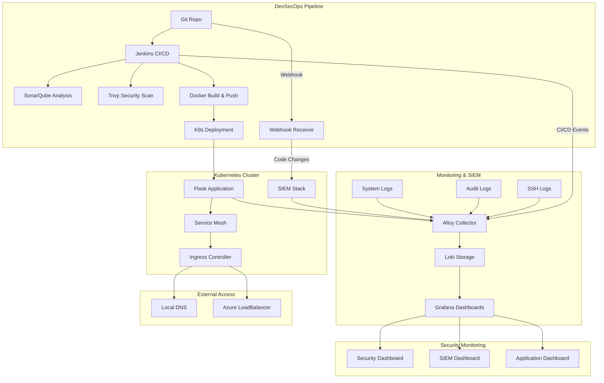
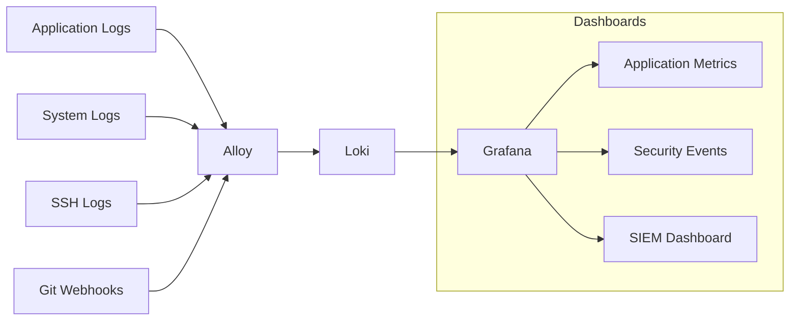

# 🚀 Flask DevSecOps - Complete CI/CD Security Pipeline with SIEM

[](https://opensource.org/licenses/MIT)
[](https://www.docker.com/)
[](https://kubernetes.io/)
[](https://www.python.org/)
[](https://www.ansible.com/)

A complete secure Flask application deployment solution on Kubernetes with integrated DevSecOps pipeline, advanced monitoring, and **SIEM (Security Information and Event Management)** capabilities.

## 📋 Table of Contents

- [🎯 Overview](#-overview)
- [🏗️ Architecture](#️-architecture)
- [⚡ Quick Installation](#-quick-installation)
- [🧩 Components](#-components)
- [🛡️ SIEM](#️-siem)
- [📊 Monitoring](#-monitoring)
- [🤖 Automation with Ansible](#-automation-with-ansible)
- [🔒 Security](#-security)
- [☁️ Infrastructure Terraform (Azure)](#️-infrastructure-terraform-azure)
- [🛠️ Development](#️-development)
- [🗑️ Cleanup](#️-cleanup)
- [🔧 Troubleshooting](#-troubleshooting)

## 🎯 Overview

### ✨ Key Features

| Component | Description | Technology |
|-----------|-------------|-------------|
| **🐍 Flask Application** | REST API with metrics and structured logs | Python 3.9+, Prometheus |
| **🔄 DevSecOps Pipeline** | Automated CI/CD with security scans | Jenkins, SonarQube, Trivy |
| **📦 K8s Orchestration** | Automated deployment, scaling and management | MicroK8s, Helm Charts |
| **📊 Complete Monitoring** | Centralized logs and real-time dashboards | Loki, Grafana, Alloy |
| **🛡️ Integrated SIEM** | Security monitoring and system events | SIEM Dashboard, Audit logs |
| **🔐 Built-in Security** | Vulnerability scans and code quality | Trivy, SonarQube |
| **☁️ Cloud Ready** | Azure support with external access | LoadBalancer, Ingress |

### 🎪 Latest Features

- ✅ **Ansible-based automation** for consistent deployments
- ✅ **SIEM integration** with SSH monitoring and webhook events
- ✅ **Automated Docker installation** 
- ✅ **Azure support** with external access
- ✅ **Development mode** with Docker Compose standalone
- ✅ **Intelligent cleanup** by components
- ✅ **Colored logs** and complete traceability
- ✅ **Multi-environment** support (dev, staging, prod)

## 🏗️ Architecture



### 🔧 Technology Stack

| Layer | Technology | Version | Role |
|--------|-------------|---------|------|
| **App** | Flask + Gunicorn | 2.3.3 | REST API, metrics |
| **Container** | Docker + BuildKit | 24.0+ | Containerization |
| **Orchestration** | MicroK8s | 1.30+ | Kubernetes Cluster |
| **Package Manager** | Helm | 3.8+ | Application deployment |
| **CI/CD** | Jenkins | 2.452+ | Automated pipeline |
| **Security** | SonarQube + Trivy | Latest | Code analysis + vulnerabilities |
| **Monitoring** | Loki + Grafana + Alloy | 3.0+ | Logs + visualization |
| **SIEM** | Auditd + Webhook Receiver | Latest | Security monitoring |
| **IaC** | Terraform + Ansible | Latest | Infrastructure + Automation |
| **Cloud** | Azure LoadBalancer | - | External access |

## ⚡ Quick Installation

### 🚀 Ansible-Based Setup (Recommended)

This project uses **Ansible** for consistent, reproducible deployments. All infrastructure is managed through playbooks.

#### Prerequisites

```bash
# Install Ansible (Ubuntu/Debian)
sudo apt update
sudo apt install -y ansible python3-pip
pip3 install kubernetes

# OR install Ansible (RHEL/CentOS)
sudo yum install -y ansible python3-pip
pip3 install kubernetes

# Clone the project
git clone <repository-url>
cd Sample-DevSecOps
```

#### Complete Infrastructure Deployment

```bash
# Deploy the complete DevSecOps infrastructure
ansible-playbook -i ansible/inventory ansible/playbooks/main.yml --ask-become-pass
```

This single command will:
- ✅ Install Docker and prerequisites
- ✅ Setup MicroK8s Kubernetes cluster
- ✅ Deploy Jenkins with custom DevSecOps image
- ✅ Install SonarQube with PostgreSQL
- ✅ Setup monitoring stack (Loki, Grafana, Alloy)
- ✅ Deploy Flask application with auto-scaling
- ✅ Configure external access (Azure LoadBalancer)
- ✅ Setup SIEM webhook endpoints

#### SIEM Host Monitoring Setup

```bash
# Setup host-level SIEM monitoring
ansible-playbook -i ansible/inventory ansible/playbooks/siem.yml --ask-become-pass
```

This will install:
- 🛡️ fail2ban for intrusion prevention
- 📋 auditd for system call monitoring
- 📊 logwatch for log analysis
- 🔍 chkrootkit for rootkit detection

#### Development Mode

```bash
# Quick development setup with Docker Compose
ansible-playbook -i ansible/inventory ansible/playbooks/development.yml
```

### 📋 System Requirements

| Component | Minimum | Recommended |
|-----------|---------|-------------|
| **OS** | Ubuntu 20.04+ | Ubuntu 22.04 LTS |
| **CPU** | 2 cores | 4+ cores |
| **RAM** | 4GB | 8GB+ |
| **Storage** | 10GB free | 20GB+ |
| **Docker** | 20.10+ | 24.0+ |
| **Git** | 2.25+ | Latest |
| **Ansible** | 2.9+ | Latest |

## 🧩 Components

### 🐍 Flask Application

**Available Endpoints:**

```bash
GET  /                    # Homepage with status
GET  /health              # Health check for K8s
GET  /api/users           # List users (JSON)
POST /api/users           # Create user
PUT  /api/users/{id}      # Update user
DELETE /api/users/{id}    # Delete user
GET  /metrics             # Prometheus metrics
GET  /logs                # Real-time logs interface
```

**Features:**

- ✅ Structured JSON logs
- ✅ Integrated Prometheus metrics
- ✅ Kubernetes health checks
- ✅ Centralized error handling
- ✅ Rate limiting
- ✅ CORS configured

### 🔄 DevSecOps Pipeline

**Jenkins Pipeline Stages:**

1. **🔍 Code Checkout** - Git repository clone
2. **🧪 Unit Tests** - Automated testing with coverage
3. **🔒 Security Scan** - Trivy vulnerability analysis
4. **📊 Quality Gate** - SonarQube code analysis
5. **🐳 Docker Build** - Multi-stage optimized build
6. **📦 Image Push** - Secure registry push
7. **🚀 K8s Deploy** - Rolling deployment with health checks
8. **✅ Smoke Tests** - Post-deployment validation

**Automated Security Checks:**

- 🛡️ **Trivy** - Container vulnerability scanning
- 📊 **SonarQube** - Static code analysis and security hotspots
- 🔐 **OWASP** - Security best practices validation
- 🐳 **Docker** - Image security scanning

## 🛡️ SIEM (Security Information and Event Management)

Our integrated SIEM solution provides comprehensive security monitoring across the entire infrastructure:

### 🔧 SIEM Components

| Component | Function | Data Sources |
|-----------|----------|-------------|
| **Alloy Collector** | Log aggregation and processing | System logs, SSH logs, application logs |
| **Webhook Receiver** | Git event monitoring | Code commits, pushes, branch changes |
| **Loki Storage** | Centralized log storage | All security events and logs |
| **Grafana SIEM Dashboard** | Security visualization | Real-time security metrics |

### 🎯 Monitored Security Events

**SSH and Authentication:**
- ✅ SSH login attempts (successful/failed)
- ✅ Root access attempts
- ✅ Failed authentication patterns
- ✅ Suspicious login times and locations

**Code Security:**
- ✅ Git commits and pushes
- ✅ Branch creation/deletion
- ✅ Merge requests
- ✅ CI/CD pipeline security events

**System Security:**
- ✅ System calls audit (auditd)
- ✅ File access monitoring
- ✅ Process execution tracking
- ✅ Network connection monitoring

**Application Security:**
- ✅ API endpoint access
- ✅ Error patterns and exceptions
- ✅ Performance anomalies
- ✅ Rate limiting violations

### 🚨 Security Alerts

The SIEM dashboard categorizes events by severity:

- 🔴 **Critical** - Immediate security threats
- 🟠 **High** - Significant security events
- 🟡 **Medium** - Notable security activities
- 🟢 **Low** - Information security events

### 📊 SIEM Dashboard Features

**Real-time Monitoring:**
- SSH events timeline
- Failed login attempts map
- Security event distribution
- Top attacked IPs and users

**Historical Analysis:**
- Security trends over time
- Attack pattern analysis
- User behavior analytics
- System health correlation

### 🛠️ SIEM Configuration

The SIEM system is configured through:

```bash
# SIEM configuration files
siem/
├── alloy-siem-config.alloy       # Alloy collector configuration
├── grafana-siem-dashboard.json   # Security dashboard
└── webhook-receiver.yaml         # Git webhook endpoint

# Host monitoring setup
ansible/playbooks/siem.yml         # SIEM host configuration
```

**Host-level Monitoring Tools:**

- **fail2ban** - Intrusion prevention system
- **auditd** - Linux audit framework
- **logwatch** - Log analysis and reporting
- **chkrootkit** - Rootkit detection

## 📊 Monitoring

### 🔍 Log Processing Flow



### 📈 Available Dashboards

1. **🎯 Application Dashboard**
   - Request rates and response times
   - Error rates and status codes
   - Database performance metrics
   - Custom business metrics

2. **🛡️ Security Dashboard**
   - Authentication events
   - Failed login attempts
   - API security metrics
   - Rate limiting violations

3. **🚨 SIEM Dashboard**
   - SSH monitoring and intrusion attempts
   - Code change tracking via webhooks
   - System-level security events
   - Threat intelligence and alerts

### 🎛️ Metrics Collection

**Application Metrics:**
- HTTP request metrics (Prometheus format)
- Custom business logic metrics
- Database query performance
- Error tracking and alerting

**Infrastructure Metrics:**
- Container resource usage
- Kubernetes cluster health
- Network traffic analysis
- Storage utilization

**Security Metrics:**
- Authentication success/failure rates
- API endpoint access patterns
- Security scan results
- Vulnerability trends

### 🎯 Access Information

After deployment, access your services:

```bash
# Get access information
ansible-playbook -i ansible/inventory ansible/playbooks/main.yml --tags=access_info

# Manual access URLs (replace with your external IP)
Jenkins:    http://<EXTERNAL_IP>:32000  (admin/admin123)
SonarQube:  http://<EXTERNAL_IP>:32001  (admin/admin123)
Grafana:    http://<EXTERNAL_IP>:32002  (admin/admin123)
Flask App:  http://<EXTERNAL_IP>:32003
```

**Default Credentials:**
- Jenkins: `admin/admin123`
- SonarQube: `admin/admin123`
- Grafana: `admin/admin123`

⚠️ **Security Note:** Change default passwords in production!

## 🤖 Automation with Ansible

This project has transitioned to a **full Ansible-based automation approach** for consistent, reproducible deployments across environments.

### 📁 Ansible Structure

```
ansible/
├── ansible.cfg                 # Ansible configuration
├── inventory                   # Hosts inventory
├── requirements.yml           # Ansible dependencies
├── playbooks/
│   ├── main.yml              # Complete infrastructure deployment
│   ├── siem.yml              # SIEM host monitoring setup
│   ├── development.yml       # Development environment
│   └── cleanup.yml           # Infrastructure cleanup
├── roles/                    # Reusable roles (if needed)
└── vars/
    └── main.yml              # Global variables
```

### 🚀 Available Playbooks

#### 1. **Complete Infrastructure** (`main.yml`)

Deploys the entire DevSecOps infrastructure:

```bash
ansible-playbook -i inventory playbooks/main.yml --ask-become-pass
```

**What it deploys:**
- ✅ Docker installation and configuration
- ✅ MicroK8s cluster with required addons
- ✅ Jenkins with custom DevSecOps image
- ✅ SonarQube with PostgreSQL backend
- ✅ Monitoring stack (Loki, Grafana, Alloy)
- ✅ Flask application with auto-scaling
- ✅ SIEM webhook endpoints
- ✅ External access configuration
- ✅ DNS and service discovery

#### 2. **SIEM Host Monitoring** (`siem.yml`)

Configures host-level security monitoring:

```bash
ansible-playbook -i inventory playbooks/siem.yml --ask-become-pass
```

**What it configures:**
- 🛡️ fail2ban intrusion prevention
- 📋 auditd system call monitoring
- 📊 logwatch log analysis
- 🔍 chkrootkit rootkit detection
- 📝 Custom security monitoring scripts
- ⏰ Automated security reporting

#### 3. **Development Environment** (`development.yml`)

Quick development setup with Docker Compose:

```bash
ansible-playbook -i inventory playbooks/development.yml
```

**Development features:**
- 🐳 Docker Compose stack
- 🔄 Hot reload for development
- 📊 Local monitoring stack
- 🧪 Testing environment

#### 4. **Infrastructure Cleanup** (`cleanup.yml`)

Interactive cleanup with selective removal:

```bash
ansible-playbook -i inventory playbooks/cleanup.yml --ask-become-pass
```

**Cleanup options:**
- ⚠️ Interactive confirmation prompts
- 🗑️ Selective component removal
- 🐳 Optional Docker image cleanup
- 🛡️ Optional SIEM tools removal
- 🔧 Optional MicroK8s removal

### ⚙️ Ansible Variables

Configure your deployment through `vars/main.yml`:

```yaml
# Cluster configuration
cluster_name: "devsecops-cluster"
external_access: true

# Application settings
app_name: "flask-k8s-app"
app_namespace: "flask-app"
app_replicas: 2

# Monitoring settings
monitoring_namespace: "monitoring"
grafana_admin_password: "admin123"

# Security settings
enable_siem: true
siem_webhook_port: 3100
fail2ban_enabled: true

# External access
azure_loadbalancer: true
external_domain: "your-domain.com"
```

### 🔧 Ansible Configuration

Key configuration in `ansible.cfg`:

```ini
[defaults]
inventory = inventory
host_key_checking = False
pipelining = True
callback_whitelist = profile_tasks, timer

[privilege_escalation]
become = True
become_method = sudo
become_user = root
become_ask_pass = True
```

### 📦 Dependencies

Install required Ansible collections:

```bash
ansible-galaxy install -r requirements.yml
```

Dependencies include:
- `kubernetes.core` - Kubernetes module
- `community.docker` - Docker management
- `community.general` - General utilities

### 🎯 Ansible Best Practices

**Idempotency:**
- ✅ All tasks are idempotent
- ✅ Safe to run multiple times
- ✅ Only changes what's necessary

**Error Handling:**
- ✅ Comprehensive error handling
- ✅ Rollback capabilities
- ✅ Detailed logging and feedback

**Security:**
- ✅ Secure credential handling
- ✅ Encrypted variables support
- ✅ Minimal privilege principles

## 🔒 Security

### 🛡️ Security Layers

| Layer | Implementation | Tools |
|-------|---------------|-------|
| **Container Security** | Image scanning and hardening | Trivy, Docker Security |
| **Code Security** | Static analysis and quality gates | SonarQube, OWASP |
| **Infrastructure Security** | Network policies and RBAC | K8s Security Policies |
| **Runtime Security** | Real-time monitoring and SIEM | Alloy, Grafana, fail2ban |
| **Access Security** | Authentication and authorization | JWT, RBAC, SSH monitoring |

### 🔐 Security Best Practices

**Implemented Security Measures:**

- ✅ **Multi-stage Docker builds** with minimal attack surface
- ✅ **Non-root container execution** 
- ✅ **Security contexts** in Kubernetes
- ✅ **Network policies** for pod-to-pod communication
- ✅ **RBAC** (Role-Based Access Control)
- ✅ **TLS encryption** for all communications
- ✅ **Secret management** with Kubernetes secrets
- ✅ **Regular security scanning** in CI/CD pipeline
- ✅ **SIEM monitoring** for threat detection
- ✅ **Intrusion prevention** with fail2ban

**Security Scanning Integration:**

```bash
# Trivy security scan results in Jenkins
- Container vulnerabilities: CRITICAL, HIGH, MEDIUM, LOW
- License compliance checks
- Configuration security validation
- Secrets detection in code

# SonarQube quality gates
- Security hotspots identification
- Code smells and technical debt
- Test coverage requirements
- Maintainability index validation
```

## ☁️ Infrastructure Terraform (Azure)

Deploy to Azure cloud infrastructure:

### 🏗️ Terraform Configuration

```bash
cd terraform/

# Initialize Terraform
terraform init

# Plan deployment
terraform plan -var-file="terraform.tfvars"

# Apply infrastructure
terraform apply -var-file="terraform.tfvars"
```

**Azure Resources Created:**
- 🖥️ Virtual Machine with Ubuntu 22.04
- 🌐 Virtual Network and Security Groups
- 💾 Managed Disks for persistent storage
- 🔒 SSH Key pair management
- 🌍 Public IP with LoadBalancer
- 📊 Monitoring and diagnostics

### 🔐 Azure Integration

After Terraform deployment, run Ansible:

```bash
# Update inventory with Azure VM IP
echo "[azure]" > ansible/inventory
echo "azure-vm ansible_host=<AZURE_PUBLIC_IP> ansible_user=azureuser" >> ansible/inventory

# Deploy with Azure-specific configuration
ansible-playbook -i inventory playbooks/main.yml --ask-become-pass -e azure_deployment=true
```

## 🛠️ Development

### 🧪 Local Development

**Quick Start with Docker Compose:**

```bash
# Development setup
ansible-playbook -i inventory playbooks/development.yml

# OR manual Docker Compose
docker-compose up -d

# Access services
- Flask App: http://localhost:5000
- Jenkins: http://localhost:8080
- SonarQube: http://localhost:9000
- Grafana: http://localhost:3000
```

### 🔄 CI/CD Pipeline Development

**Jenkins Pipeline Configuration:**

```groovy
pipeline {
    agent any
    stages {
        stage('Checkout') {
            steps {
                git branch: 'main', url: 'your-repo-url'
            }
        }
        stage('Security Scan') {
            steps {
                sh 'trivy fs .'
            }
        }
        stage('Quality Gate') {
            steps {
                withSonarQubeEnv('SonarQube') {
                    sh './gradlew sonarqube'
                }
            }
        }
        stage('Build & Deploy') {
            steps {
                sh 'ansible-playbook -i inventory playbooks/main.yml'
            }
        }
    }
}
```

### 🧪 Testing

**Run Tests:**

```bash
# Unit tests
cd app/
python -m pytest tests/ -v

# Integration tests
kubectl exec -n flask-app deployment/flask-app -- python -m pytest tests/integration/

# Security tests
trivy fs app/
sonar-scanner -Dsonar.projectKey=flask-k8s-app
```

## 🗑️ Cleanup

### 🧹 Selective Cleanup

The cleanup playbook provides interactive options:

```bash
ansible-playbook -i inventory playbooks/cleanup.yml --ask-become-pass
```

**Cleanup prompts:**
1. ⚠️ **Confirmation** - Confirms destructive action
2. 🐳 **Docker Images** - Remove custom images
3. 🛡️ **SIEM Tools** - Remove host monitoring
4. 🔧 **MicroK8s** - Complete cluster removal

### 🚨 Emergency Cleanup

Quick complete removal:

```bash
# Stop all services
sudo microk8s stop

# Remove all deployments
sudo microk8s kubectl delete all --all --all-namespaces

# Remove MicroK8s
sudo snap remove microk8s

# Clean Docker
docker system prune -af
```

## 🔧 Troubleshooting

### 🚨 Common Issues

#### Ansible Connection Issues

```bash
# Test connectivity
ansible -i inventory all -m ping

# Debug SSH issues
ansible-playbook -i inventory playbooks/main.yml -vvv

# Fix SSH key issues
ssh-keygen -R <target_host_ip>
```

#### Kubernetes Issues

```bash
# Check cluster status
microk8s status --wait-ready

# Debug pod issues
microk8s kubectl get pods --all-namespaces
microk8s kubectl describe pod <pod-name> -n <namespace>
microk8s kubectl logs <pod-name> -n <namespace>

# Reset MicroK8s
microk8s reset
```

#### Docker Issues

```bash
# Check Docker status
sudo systemctl status docker

# Fix Docker permissions
sudo usermod -aG docker $USER
newgrp docker

# Clean Docker system
docker system prune -f
```

#### SIEM Issues

```bash
# Check Alloy logs
microk8s kubectl logs -n monitoring deployment/alloy

# Test webhook endpoint
curl -X POST http://<external-ip>:3100/webhook \
  -H "Content-Type: application/json" \
  -d '{"test": "data"}'

# Check SIEM host services
sudo systemctl status fail2ban
sudo systemctl status auditd
```

### 📊 Monitoring and Logs

**Access logs for troubleshooting:**

```bash
# Application logs
microk8s kubectl logs -n flask-app deployment/flask-app -f

# Jenkins logs
microk8s kubectl logs -n jenkins deployment/jenkins -f

# Grafana logs
microk8s kubectl logs -n monitoring deployment/grafana -f

# SIEM webhook logs
microk8s kubectl logs -n monitoring deployment/alloy | grep webhook
```

### 🆘 Support

**Getting Help:**

1. 📖 Check the logs first
2. 🔍 Search existing issues
3. 📝 Create detailed issue reports
4. 🤝 Include environment details
5. 📊 Provide relevant logs

**Debug Information Collection:**

```bash
# Collect system info
ansible-playbook -i inventory playbooks/main.yml --tags=debug_info

# Generate support bundle
microk8s kubectl cluster-info dump > cluster-info.txt
```

---

## 📄 License

This project is licensed under the MIT License - see the [LICENSE](LICENSE) file for details.

## 🤝 Contributing

1. Fork the repository
2. Create a feature branch
3. Make your changes
4. Add tests if applicable
5. Update documentation
6. Submit a pull request

## 🙏 Acknowledgments

- **Flask** team for the excellent web framework
- **Kubernetes** community for container orchestration
- **Grafana Labs** for monitoring solutions
- **Jenkins** team for CI/CD automation
- **Ansible** community for infrastructure automation
- **Security tools** developers (Trivy, SonarQube, fail2ban)

---

**Happy DevSecOps! 🚀🛡️**
