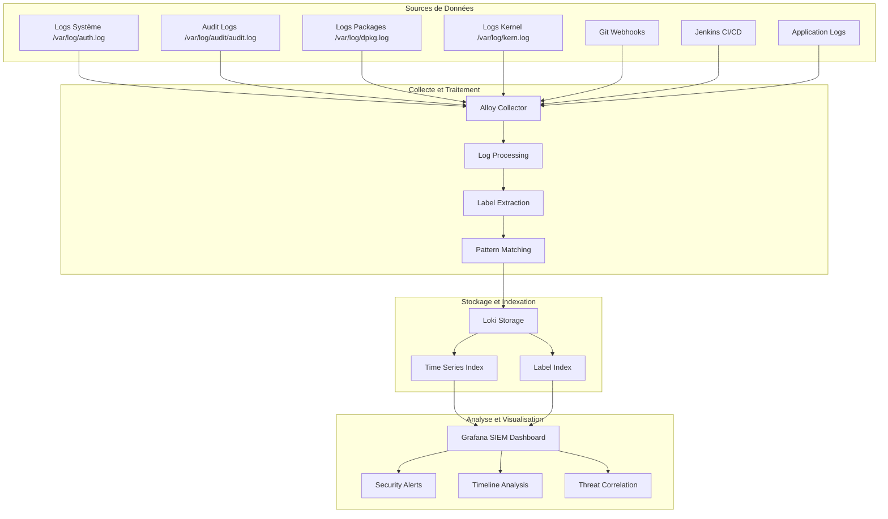

# 🛡️ SIEM Documentation - Security Information and Event Management

## 📋 Vue d'ensemble

Le système SIEM (Security Information and Event Management) intégré dans cette plateforme DevSecOps fournit une surveillance en temps réel des événements de sécurité, permettant la détection proactive des menaces et la corrélation d'événements.

## 🏗️ Architecture SIEM



## 📊 Capacités de Surveillance

### 🔐 Événements d'Authentification

**Source:** `/var/log/auth.log`

**Événements capturés:**
- Connexions SSH réussies/échouées
- Utilisation de sudo
- Changements de mot de passe
- Tentatives d'authentification invalides

**Labels extraits:**
```yaml
auth_type: "Accepted|Failed|Invalid"
user: "nom_utilisateur"
source_ip: "adresse_ip_source"
hostname: "nom_hôte"
service: "ssh|sudo|passwd"
```

**Requêtes LogQL utiles:**
```logql
# Échecs d'authentification
{job="auth"} |= "Failed"

# Connexions par IP suspecte
{job="auth", auth_type="Failed"} | json | source_ip != "127.0.0.1"

# Activité sudo
{job="auth"} |= "sudo"
```

### 📦 Gestion des Packages

**Source:** `/var/log/dpkg.log`

**Événements capturés:**
- Installations de packages
- Mises à jour système
- Suppressions de logiciels
- Configurations de packages

**Labels extraits:**
```yaml
action: "install|remove|upgrade|configure"
package: "nom_package"
log_type: "system_changes"
```

**Requêtes LogQL utiles:**
```logql
# Installations récentes
{job="packages", action="install"}

# Packages sensibles
{job="packages"} |= "ssh|sudo|passwd|shadow"
```

### 🔄 Changements de Code (Git Webhooks)

**Source:** Webhook receiver `/tmp/webhooks/`

**Événements capturés:**
- Push events
- Informations de commit
- Branches modifiées
- Métadonnées d'auteur

**Labels extraits:**
```yaml
repository: "nom_repo"
branch: "nom_branche"
pusher: "nom_utilisateur"
log_type: "code_changes"
```

**Requêtes LogQL utiles:**
```logql
# Tous les changements de code
{log_type="code_changes"}

# Pushes sur master/main
{log_type="code_changes"} |= "refs/heads/main"
```

### 🏗️ Événements CI/CD

**Source:** Jenkins logs

**Événements capturés:**
- Démarrages de builds
- Fins de builds
- Statuts de déploiement
- Erreurs de pipeline

**Labels extraits:**
```yaml
build_action: "Started|Finished"
job_name: "nom_job"
build_number: "numéro_build"
log_type: "cicd"
```

## 🎯 Cas d'Usage Sécurité

### 1. Détection d'Intrusion

**Scénario:** Tentatives de connexion SSH répétées
```logql
# Alertes sur échecs multiples
sum by (source_ip) (
  count_over_time({job="auth", auth_type="Failed"} [5m])
) > 5
```

### 2. Surveillance des Privilèges

**Scénario:** Utilisation anormale de sudo
```logql
# Commandes sudo suspectes
{job="auth"} |= "sudo" |= "passwd|shadow|su"
```

### 3. Corrélation Événements

**Scénario:** Code push + déploiement + erreurs
```logql
# Timeline des événements
{log_type=~"code_changes|cicd|application"}
```

### 4. Analyse Géographique

**Scénario:** Connexions depuis des IP suspectes
```logql
# Top des IPs source
topk(10, sum by (source_ip) (
  count_over_time({source_ip!=""} [1h])
))
```

## 📈 Dashboard SIEM

Le dashboard SIEM Grafana (`monitoring/grafana/dashboards/siem-dashboard.json`) fournit:

### Panneaux Principaux

1. **🔐 Authentication Events**
   - Logs d'authentification en temps réel
   - Filtrage par niveau d'erreur

2. **📊 Login Attempts Summary**
   - Statistiques de connexions
   - Seuils d'alerte configurables

3. **🔄 Code Changes**
   - Événements Git webhook
   - Informations de commit détaillées

4. **🏗️ CI/CD Pipeline Events**
   - Activité Jenkins
   - Status des builds

5. **📦 System Changes**
   - Installations de packages
   - Modifications système

6. **⚠️ Security Alerts**
   - Table des événements critiques
   - Tri par priorité

7. **📈 Event Timeline**
   - Visualisation temporelle
   - Corrélation d'événements

8. **🌍 Geographic Analysis**
   - Top des IPs source
   - Analyse géographique

9. **👥 User Activity**
   - Activité par utilisateur
   - Détection d'anomalies

### Configuration d'Alertes

```yaml
# Exemple d'alerte Grafana
- alert: TooManyFailedLogins
  expr: sum(rate({job="auth", auth_type="Failed"}[5m])) > 0.1
  for: 2m
  annotations:
    summary: "Trop de tentatives de connexion échouées"
    description: "{{ $value }} échecs de connexion par minute"
```

## 🔧 Configuration et Déploiement

### 1. Déploiement via setup.sh

```bash
./setup.sh
# Sélectionner option 7: Deploy SIEM Stack
```

### 2. Déploiement via Ansible

```bash
cd ansible/
ansible-playbook playbooks/siem.yml --ask-become-pass
```

### 3. Configuration Webhook Git

```bash
# Script automatisé
./configure-webhook.sh

# Configuration manuelle
URL: http://webhook.VOTRE_IP.nip.io/webhook
Content-Type: application/json
Events: Push events + Pull requests
```

### 4. Import Dashboard Grafana

1. Accéder à Grafana: `http://grafana.VOTRE_IP.nip.io`
2. Login: admin/admin123
3. Navigation: + → Import
4. Upload: `monitoring/grafana/dashboards/siem-dashboard.json`

## 🛠️ Maintenance et Troubleshooting

### Vérification des Logs

```bash
# Logs système
sudo tail -f /var/log/auth.log

# Logs webhook
tail -f /tmp/webhooks/webhook-*.log

# Logs Alloy
kubectl logs -n monitoring daemonset/alloy -f

# Logs Loki
kubectl logs -n monitoring statefulset/loki -f
```

### Nettoyage SIEM

```bash
./setup.sh
# Sélectionner option 12: Cleanup Options → option 3: Cleanup SIEM Stack
```

### Règles d'Audit

Les règles d'audit sont configurées dans `/etc/audit/rules.d/siem.rules`:

```bash
# Fichiers critiques
-w /etc/passwd -p wa -k identity
-w /etc/shadow -p wa -k identity
-w /etc/sudoers -p wa -k identity

# Commandes privilégiées
-w /bin/su -p x -k privileged
-w /usr/bin/sudo -p x -k privileged

# Gestion des packages
-w /usr/bin/apt -p x -k package_management
```

## 🚨 Réponse aux Incidents

### 1. Détection d'Intrusion

**Actions:**
1. Identifier l'IP source dans le dashboard
2. Vérifier les logs système correspondants
3. Bloquer l'IP si nécessaire: `sudo iptables -A INPUT -s IP_ADDRESS -j DROP`

### 2. Changements Non Autorisés

**Actions:**
1. Analyser les logs de packages
2. Vérifier l'authenticité des changements
3. Rollback si nécessaire

### 3. Activité Suspecte

**Actions:**
1. Corréler les événements temporellement
2. Analyser les patterns d'activité
3. Alerter les équipes sécurité

## 📚 Ressources Complémentaires

- [LogQL Documentation](https://grafana.com/docs/loki/latest/logql/)
- [Grafana Alerting](https://grafana.com/docs/grafana/latest/alerting/)
- [Auditd Configuration](https://linux.die.net/man/8/auditd)
- [Git Webhooks](https://docs.github.com/en/developers/webhooks-and-events/webhooks)

---

**🛡️ Sécurité renforcée par la surveillance continue et l'analyse proactive des menaces**
