# DevSecOps Platform Documentation

<!-- TOC -->
- [1. Introduction](#1-introduction)
  - [1.1 Project Overview](#11-project-overview)
  - [1.2 Key Features](#12-key-features)
  - [1.3 Architecture Overview](#13-architecture-overview)
- [2. Technology Stack](#2-technology-stack)
  - [2.1 Comparison and Selection Rationale](#21-comparison-and-selection-rationale)
  - [2.2 Component Integration](#22-component-integration)
- [3. Installation Guide](#3-installation-guide)
  - [3.1 Prerequisites](#31-prerequisites)
  - [3.2 Automated Setup](#32-automated-setup)
  - [3.3 Manual Installation Steps](#33-manual-installation-steps)
- [4. Configuration Guide](#4-configuration-guide)
  - [4.1 Kubernetes Configuration](#41-kubernetes-configuration)
  - [4.2 CI/CD Pipeline Setup](#42-cicd-pipeline-setup)
  - [4.3 Security Tools Configuration](#43-security-tools-configuration)
  - [4.4 Monitoring Setup](#44-monitoring-setup)
- [5. Usage Guide](#5-usage-guide)
  - [5.1 Deploying Applications](#51-deploying-applications)
- [6. Integration Guide](#6-integration-guide)
  - [6.1 Jenkins and SonarQube Integration](#61-jenkins-and-sonarqube-integration)
  - [6.2 Git SCM Polling Configuration](#62-git-scm-polling-configuration)
  - [6.3 Security Tool Integration](#63-security-tool-integration)
- [7. Troubleshooting](#7-troubleshooting)
  - [7.1 Common Issues](#71-common-issues)
  - [7.2 Debugging Techniques](#72-debugging-techniques)
- [8. References and Resources](#8-references-and-resources)
<!-- /TOC -->

## 1. Introduction

### 1.1 Project Overview

This DevSecOps platform provides a comprehensive solution for secure application deployment on Kubernetes with integrated security scanning, continuous integration/continuous deployment (CI/CD), and centralized logging. The platform is designed to help development and operations teams implement security practices throughout the software development lifecycle.

The project addresses three main objectives:

1. **Secure Kubernetes Deployment**: Establish a robust Kubernetes environment for deploying applications with security best practices built-in.
2. **DevSecOps Pipeline Integration**: Integrate security tools into the CI/CD pipeline to ensure continuous security validation.
3. **Centralized Logging and Monitoring**: Implement a unified system for collecting, storing, and visualizing logs and security events.

This platform is ideal for organizations looking to:
- Implement security-first development practices
- Automate security scanning and testing
- Maintain compliance with security standards
- Gain visibility into application and infrastructure security

### 1.2 Key Features

The DevSecOps platform includes the following key features:

- **Complete Kubernetes Environment**: MicroK8s-based Kubernetes cluster with essential add-ons
- **Automated Deployment**: Ansible playbooks for consistent and repeatable deployments
- **CI/CD Pipeline**: Jenkins-based pipeline with integrated security scanning
- **Static Code Analysis**: SonarQube integration for code quality and security scanning
- **Container Security**: Trivy scanner for identifying vulnerabilities in container images
- **Infrastructure as Code**: Terraform templates for cloud infrastructure provisioning
- **Centralized Logging**: Loki and Grafana Alloy for efficient log collection and visualization
- **Security Monitoring**: Custom security dashboards for threat detection and monitoring
- **Development Environment**: Docker Compose setup for local development
- **Interactive Setup**: User-friendly setup script with multiple deployment options

### 1.3 Architecture Overview

The platform architecture consists of several interconnected components working together to provide a complete DevSecOps environment:

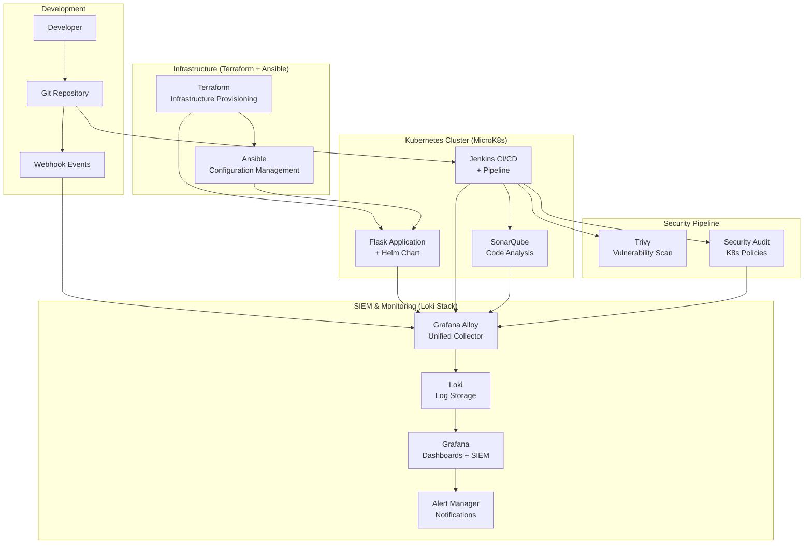

**Key Components:**

1. **Development**: Developers commit code to a Git repository, triggering webhook events.
2. **Infrastructure**: Terraform provisions cloud resources, and Ansible configures the environment.
3. **Kubernetes Cluster**: MicroK8s hosts the application, Jenkins CI/CD pipeline, and SonarQube.
4. **Security Pipeline**: Jenkins orchestrates security scans using Trivy and SonarQube.
5. **SIEM & Monitoring**: Grafana Alloy collects logs, Loki stores them, and Grafana provides visualization and alerting.

This architecture ensures that security is integrated at every stage of the development and deployment process, from code commit to production monitoring.

## 2. Technology Stack

### 2.1 Comparison and Selection Rationale

This section provides a detailed analysis of the technologies selected for the DevSecOps platform, comparing alternatives and explaining the rationale behind each choice.

#### Kubernetes Environment

The platform requires a Kubernetes environment that balances ease of use with production-ready features. Several options were evaluated:

| Solution | Advantages | Disadvantages | Use Cases | Cost |
|----------|-----------|---------------|-------------|------|
| **Minikube** | - Simple local installation<br>- Ideal for development<br>- No cost<br>- Integrated add-on support | - Limited resources<br>- Single node only<br>- Limited performance | Local development<br>Basic testing<br>Learning | Free |
| **Kind** | - Very lightweight<br>- Fast startup<br>- Multi-node support<br>- Excellent CI/CD integration | - Fewer features<br>- No graphical interface<br>- Volatile storage | CI/CD testing<br>Rapid development<br>Temporary environments | Free |
| **MicroK8s** | - Lightweight<br>- Full Kubernetes features<br>- Easy installation | - Smaller community<br>- Can be resource-intensive | Development<br>CI/CD<br>IoT/Edge | Free |
| **Managed K8s** | - Production-ready<br>- Scalable<br>- Provider-managed | - Cost<br>- Complexity<br>- Provider dependency | Production environments<br>High-availability applications | Paid |

**Selected Solution: MicroK8s**

MicroK8s was selected because it offers a complete Kubernetes environment with a small memory footprint, making it ideal for local development and CI/CD pipelines. It's easy to install and includes add-ons for essential features.

#### Kubernetes Package Management

Effective package management is crucial for deploying applications to Kubernetes:

| Solution | Advantages | Disadvantages | Complexity | Ecosystem |
|----------|-----------|---------------|------------|-------------|
| **Helm** | - De facto standard<br>- Large chart ecosystem<br>- Version management<br>- Powerful templating | - Learning curve<br>- Complex for simple cases<br>- Multiple dependencies | Medium | Very large |
| **Kustomize** | - Native to Kubernetes<br>- Declarative approach<br>- No templating<br>- Simplicity | - Fewer features<br>- No version management<br>- Limited ecosystem | Low | Medium |
| **YAML** | - Maximum simplicity<br>- Total control<br>- No dependencies<br>- Easy debugging | - Code duplication<br>- Difficult maintenance<br>- No reusability | Very low | N/A |

**Selected Solution: Helm**

Helm was selected as the industry standard for Kubernetes package management. It simplifies the management of complex deployments through its templating system and vast ecosystem of reusable charts.

#### Security Scanning Tools

Security scanning is essential for identifying vulnerabilities in container images and code:

| Tool | Scan Type | Advantages | Disadvantages | Cost | CI/CD Integration |
|-------|--------------|-----------|---------------|------|-------------------|
| **Trivy** | Images, FS, Git | - Very fast<br>- Comprehensive database<br>- Easy integration<br>- Supports multiple formats | - Vulnerabilities only<br>- No behavioral analysis | Free | Excellent |
| **Clair** | Container images | - In-depth analysis<br>- REST API<br>- Scalable<br>- Notifications | - Complex configuration<br>- Resource-intensive<br>- Learning curve | Free | Good |
| **Anchore** | Images, compliance | - Compliance analysis<br>- Custom policies<br>- Detailed reports<br>- Enterprise support | - Limited free version<br>- Configuration complexity | Free/Paid | Good |

**Selected Solution: Trivy**

Trivy was selected for its speed and ease of integration into CI/CD pipelines. It provides comprehensive vulnerability detection for container images, which is essential for a DevSecOps approach.

#### Static Code Analysis

Static code analysis helps identify security issues and quality problems in source code:

| Tool | Supported Languages | Advantages | Disadvantages | Cost | Report Quality |
|-------|-------------------|-----------|---------------|------|---------------------|
| **SonarQube** | 25+ languages | - Comprehensive analysis<br>- Rich web interface<br>- Metrics history<br>- Customizable rules | - Resource-intensive<br>- Complex configuration<br>- Paid license (advanced features) | Community/Paid | Excellent |
| **CodeQL** | 10+ languages | - Semantic analysis<br>- Custom queries<br>- GitHub integration<br>- High precision | - Limited to supported languages<br>- Learning curve<br>- Resource-intensive | Free (GitHub) | Very good |
| **Semgrep** | 20+ languages | - Simple rules<br>- Fast<br>- Active community<br>- Intuitive CLI | - Fewer features<br>- No web interface (free version) | Free/Paid | Good |

**Selected Solution: SonarQube Community**

SonarQube Community Edition was selected for its comprehensive static code analysis, detecting bugs, vulnerabilities, and "code smells." Its web interface allows for centralized tracking of code quality evolution.

#### CI/CD Platform

A flexible CI/CD platform is needed to automate building, testing, and deployment:

| Platform | Advantages | Disadvantages | Cost | Ecosystem |
|------------|-----------|---------------|------|-------------|
| **GitHub Actions** | - Native GitHub integration<br>- Actions marketplace<br>- Free (generous limits)<br>- Simple configuration | - Limited to GitHub repositories<br>- Fewer advanced features<br>- GitHub dependent | Free/Paid | Very large |
| **GitLab CI/CD** | - Complete GitLab integration<br>- Flexible runners<br>- Complete DevOps<br>- Auto DevOps | - Learning curve<br>- Resource-intensive<br>- Complex configuration | Free/Paid | Large |
| **Jenkins** | - Very flexible<br>- Numerous plugins<br>- Total control<br>- Open source | - Significant maintenance<br>- Security management<br>- Aging interface | Free | Very large |

**Selected Solution: Jenkins**

Jenkins was selected for its flexibility and extensibility. Its open-source nature and vast plugin ecosystem allow for building custom pipelines that are highly flexible and capable of integrating with virtually any tool.

#### Log Management

Centralized logging is crucial for monitoring and troubleshooting:

| Component | Role | Advantages | Disadvantages |
|-----------|------|-----------|---------------|
| **Loki** | Log storage | - Very resource-efficient<br>- Label-based indexing<br>- Prometheus compatible<br>- Recent version 3.5 | - Limited full-text search<br>- Reduced features vs ELK<br>- Less mature than Elasticsearch |
| **Grafana Alloy** | Telemetry collection | - Unified collector (logs/metrics/traces)<br>- Replaces Promtail<br>- Modern configuration<br>- Native OpenTelemetry support | - New (learning curve)<br>- Evolving documentation<br>- Increased complexity |
| **Grafana** | Visualization | - Modern interface<br>- Flexible dashboards<br>- Advanced alerts | - Primarily for metrics<br>- Logs secondary<br>- Fewer log features |

**Selected Solution: Loki + Grafana Alloy**

The Loki stack was selected for its modern architecture and efficiency. Loki indexes only metadata, reducing storage costs, while Grafana Alloy is the next-generation unified telemetry collector, ensuring a future-proof solution.

#### Infrastructure as Code

Infrastructure as Code tools are essential for consistent environment provisioning:

| Solution | Type | Advantages | Disadvantages | Use Cases | Complexity |
|----------|------|-----------|---------------|-------------|------------|
| **Ansible** | Configuration Management | - Agentless<br>- Simple YAML syntax<br>- Idempotent<br>- Large module ecosystem | - Performance on large inventories<br>- Sometimes difficult debugging<br>- No state management | Server configuration<br>Application deployment<br>Orchestration | Low |
| **Terraform** | Infrastructure Provisioning | - Multi-cloud<br>- State management<br>- Plan/Apply workflow<br>- Rich provider ecosystem | - Learning curve<br>- State file management<br>- Not for OS configuration | Cloud provisioning<br>Immutable infrastructure<br>Multi-environment | Medium |

**Selected Solution: Terraform + Ansible**

A hybrid approach was selected, using Terraform for cloud infrastructure provisioning (immutable) and Ansible for service configuration (mutable). This approach maximizes the advantages of each tool.

### 2.2 Component Integration

The DevSecOps platform integrates multiple technologies to create a seamless workflow from development to deployment and monitoring. Here's how the components work together:

#### Development to CI/CD Flow

1. **Code Commit**: Developers commit code to a Git repository
2. **Webhook Trigger**: Git webhooks trigger Jenkins pipeline execution
3. **Build Process**: Jenkins builds the application using Dockerfile
4. **Security Scanning**:
   - SonarQube performs static code analysis
   - Trivy scans container images for vulnerabilities
5. **Deployment**: Helm charts deploy the application to MicroK8s

#### Infrastructure Management Flow

1. **Cloud Provisioning**: Terraform creates Azure infrastructure
2. **Environment Configuration**: Ansible configures the MicroK8s cluster
3. **Service Deployment**: Ansible and Helm deploy core services
4. **Monitoring Setup**: Loki and Grafana are configured for logging

#### Security Integration Points

1. **Development**: SonarQube analyzes code during development
2. **Build**: Trivy scans container images during build
3. **Deployment**: Kubernetes policies enforce security standards
4. **Runtime**: Grafana Alloy collects security events
5. **Monitoring**: Grafana dashboards visualize security metrics

#### Technology Stack Versions

| Layer | Technology | Version | Role |
|--------|-------------|---------|------|
| **Application** | Flask + Gunicorn | 2.3+ | REST API, metrics |
| **Containerization** | Docker + BuildKit | 24.0+ | Secure images |
| **Orchestration** | MicroK8s | 1.30+ | Kubernetes cluster |
| **Package Management** | Helm | 3.8+ | K8s deployment |
| **CI/CD** | Jenkins | 2.452+ | Automated pipeline |
| **Code Quality** | SonarQube Community | Latest | Static analysis |
| **Security Scan** | Trivy | Latest | Vulnerabilities |
| **Log Management** | Loki + Alloy | 3.0+ | Centralized logs |
| **Monitoring** | Grafana | 10.0+ | Dashboards + SIEM |
| **Infrastructure** | Terraform | 1.5+ | Cloud provisioning |
| **Configuration** | Ansible | 2.15+ | Automation |
| **Cloud Platform** | Azure | - | Cloud infrastructure |

## 3. Installation Guide

### 3.1 Prerequisites

Before installing the DevSecOps platform, ensure your system meets the following requirements:

#### System Requirements

- **Operating System**: Ubuntu 20.04 LTS or later
- **CPU**: 2+ cores recommended (4+ for production use)
- **RAM**: 8GB minimum (16GB+ recommended for production)
- **Storage**: 40GB+ free disk space
- **Network**: Internet access for downloading packages

#### Required Software

| Software | Minimum Version | Purpose |
|----------|-----------------|---------|
| **Python** | 3.8+ | Required for Ansible and applications |
| **Ansible** | 2.15+ | Automation and deployment |
| **Git** | Any recent version | Source code management |
| **Snap** | Latest | Package management for MicroK8s |

#### Optional Software

The following software will be installed automatically if not present:

- **Docker**: Container runtime
- **K8s**: Kubernetes distribution
- **Helm**: Kubernetes package manager

#### Cloud Deployment (Azure)

If deploying to Azure, you'll also need:

- **Terraform** >= 1.0
- **Azure CLI** >= 2.30
- **SSH client** for VM access
- **Azure subscription** with Contributor access

```bash
# Install Terraform (Windows)
choco install terraform

# Install Azure CLI (Windows)
choco install azure-cli
```

#### Network Requirements

Ensure the following ports are available:

| Service | Port | Protocol | Purpose |
|---------|------|----------|---------|
| **Jenkins** | 8080 | HTTP | Web UI |
| **SonarQube** | 9000 | HTTP | Web UI |
| **Grafana** | 3000 | HTTP | Web UI |
| **Flask App** | 5000 | HTTP | Web application |
| **Loki** | 3100 | HTTP | Log ingestion |
| **SSH** | 22 | TCP | Remote access |

### 3.2 Automated Setup

The DevSecOps platform includes a comprehensive setup script that provides an interactive menu for installation and configuration.

#### Using the Setup Script

1. **Clone the repository**:
   ```bash
   git clone <repository-url>
   cd Sample-DevSecOps
   ```

2. **Make the script executable**:
   ```bash
   chmod +x setup.sh
   ```

3. **Run the setup script**:
   ```bash
   ./setup.sh
   ```

4. **Navigate the interactive menu**:

   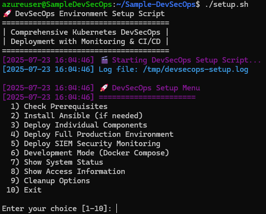
   *Image: Setup script main menu*

   The menu provides the following options:
   - **Check Prerequisites**: Verify system requirements
   - **Install Ansible**: Install Ansible if not present
   - **Deploy Individual Components**: Install specific components
   - **Deploy Full Production Environment**: Complete installation
   - **Deploy SIEM Security Monitoring**: Security monitoring only
   - **Development Mode**: Docker Compose based environment
   - **Show System Status**: Check deployment status
   - **Show Access Information**: Display service URLs and credentials
   - **Cleanup Options**: Remove services

#### Deployment Options

The setup script supports several deployment scenarios:

1. **Full Production Environment**:
   ```bash
   ./setup.sh
   # Select option 4) Deploy Full Production Environment
   ```

2. **Development Mode** (Docker Compose):
   ```bash
   ./setup.sh
   # Select option 6) Development Mode
   ```

3. **Individual Components**:
   ```bash
   ./setup.sh
   # Select option 3) Deploy Individual Components
   # Then select the specific component to install
   ```

### 3.3 Manual Installation Steps

If you prefer to install components manually or need more control over the installation process, follow these steps:

#### 1. Install Prerequisites

```bash
# Update package lists
sudo apt update

# Install required packages
sudo apt install -y software-properties-common git curl

# Install Python 3 and pip
sudo apt install -y python3 python3-pip
```

#### 2. Install Ansible

```bash
# Add Ansible repository
sudo add-apt-repository --yes --update ppa:ansible/ansible

# Install Ansible
sudo apt install -y ansible
```

#### 3. Install Docker

```bash
# Add Docker repository
curl -fsSL https://download.docker.com/linux/ubuntu/gpg | sudo apt-key add -
sudo add-apt-repository "deb [arch=amd64] https://download.docker.com/linux/ubuntu $(lsb_release -cs) stable"

# Install Docker
sudo apt update
sudo apt install -y docker-ce docker-ce-cli containerd.io

# Add current user to docker group
sudo usermod -aG docker $USER
```

#### 4. Install MicroK8s

```bash
# Install MicroK8s using snap
sudo snap install microk8s --classic --channel=1.30/stable

# Add current user to microk8s group
sudo usermod -aG microk8s $USER

# Create .kube directory
mkdir -p ~/.kube
sudo chown -R $USER:$USER ~/.kube

# Configure kubectl
microk8s config > ~/.kube/config

# Enable required addons
microk8s enable dns storage ingress helm3 registry
```

#### 5. Deploy Core Services

```bash
# Clone the repository if not already done
git clone <repository-url>
cd Sample-DevSecOps

# Run Ansible playbook for core services
cd ansible
ansible-playbook -i inventory playbooks/core_services.yml --ask-become-pass
```

#### 6. Deploy Monitoring Stack

```bash
# Run Ansible playbook for monitoring
cd ansible
ansible-playbook -i inventory playbooks/monitoring.yml --ask-become-pass
```

#### 7. Deploy Flask Application

```bash
# Run Ansible playbook for Flask application
cd ansible
ansible-playbook -i inventory playbooks/flask_app.yml --ask-become-pass
```

#### 8. Deploy SIEM Security Monitoring

```bash
# Run Ansible playbook for SIEM
cd ansible
ansible-playbook -i inventory siem.yml --ask-become-pass
```

#### 9. Configure Local Access

Add the following entries to your `/etc/hosts` file:

```
127.0.0.1 jenkins.local
127.0.0.1 sonarqube.local
127.0.0.1 grafana.local
127.0.0.1 flask-app.local
```

#### 10. Verify Installation

Check that all services are running:

```bash
# Check MicroK8s status
microk8s status

# Check deployments
microk8s kubectl get deployments -A

# Check services
microk8s kubectl get services -A
```

## 4. Configuration Guide

### 4.1 Kubernetes Configuration

The DevSecOps platform uses Kubernetes (MicroK8s) for orchestrating containerized applications and services. This section explains the key Kubernetes configuration files and how to customize them for your environment.

#### Kubernetes Resource Overview

The platform uses the following Kubernetes resources:

| Resource | Purpose | File |
|----------|---------|------|
| **Namespace** | Isolation for application components | `k8s/namespace.yaml` |
| **Deployment** | Application container management | `k8s/deployment.yaml` |
| **Service** | Internal networking and load balancing | `k8s/service.yaml` |
| **Ingress** | External access to services | `k8s/ingress.yaml` |
| **ConfigMap** | Non-sensitive configuration | `k8s/configmap.yaml` |
| **Secret** | Sensitive configuration | `k8s/secret.yaml` |
| **HPA** | Horizontal Pod Autoscaling | `k8s/hpa.yaml` |
| **RBAC** | Role-Based Access Control | `k8s/jenkins-rbac.yaml` |

#### Namespace Configuration

The namespace configuration creates a dedicated namespace for the Flask application:

```yaml
# File: k8s/namespace.yaml
apiVersion: v1
kind: Namespace
metadata:
  name: flask-app
  labels:
    name: flask-app
    app.kubernetes.io/name: flask-app
    app.kubernetes.io/component: namespace
```

To customize the namespace:
- Change `name` to your preferred namespace name
- Update labels as needed for your organization's standards

#### Deployment Configuration

The deployment configuration defines how the Flask application runs in Kubernetes:

```yaml
# File: k8s/deployment.yaml (key sections)
apiVersion: apps/v1
kind: Deployment
metadata:
  name: flask-app
  namespace: flask-app
spec:
  replicas: 3
  # ...
  template:
    # ...
    spec:
      containers:
      - name: flask-app
        image: localhost:32000/flask-k8s-app:latest
        # ...
        resources:
          requests:
            memory: "128Mi"
            cpu: "100m"
          limits:
            memory: "256Mi"
            cpu: "200m"
        # ...
        securityContext:
          allowPrivilegeEscalation: false
          runAsNonRoot: true
          runAsUser: 1001
          # ...
```

Key customization points:
- **Image**: Change `image` to your container image location
- **Replicas**: Adjust `replicas` based on your availability needs
- **Resources**: Modify `requests` and `limits` based on your application requirements
- **Security Context**: Adjust security settings as needed

#### Service Configuration

The service configuration exposes the application within the cluster:

```yaml
# File: k8s/service.yaml
apiVersion: v1
kind: Service
metadata:
  name: flask-app-service
  namespace: flask-app
spec:
  selector:
    app: flask-app
  ports:
  - name: http
    port: 80
    targetPort: 5000
  type: ClusterIP
```

To customize:
- Change `port` and `targetPort` to match your application
- Modify `type` to `NodePort` or `LoadBalancer` for different access methods

#### Ingress Configuration

The ingress configuration enables external access to the application:

```yaml
# File: k8s/ingress.yaml
apiVersion: networking.k8s.io/v1
kind: Ingress
metadata:
  name: flask-app-ingress
  namespace: flask-app
  annotations:
    kubernetes.io/ingress.class: "public"
    nginx.ingress.kubernetes.io/rewrite-target: /
spec:
  rules:
  - host: flask-app.local
    http:
      paths:
      - path: /
        pathType: Prefix
        backend:
          service:
            name: flask-app-service
            port:
              number: 80
```

Key customization points:
- **Host**: Change `host` to your domain name
- **Annotations**: Adjust based on your ingress controller
- **Path**: Modify if your application uses a different path

#### ConfigMap and Secret

ConfigMaps store non-sensitive configuration, while Secrets store sensitive data:

```yaml
# File: k8s/configmap.yaml
apiVersion: v1
kind: ConfigMap
metadata:
  name: flask-config
  namespace: flask-app
data:
  PORT: "5000"
  FLASK_ENV: "production"
  LOG_LEVEL: "INFO"
  # ...
```

```yaml
# File: k8s/secret.yaml
apiVersion: v1
kind: Secret
metadata:
  name: flask-secrets
  namespace: flask-app
type: Opaque
data:
  SECRET_KEY: Zmxhc2stc2VjcmV0LWtleS1mb3ItcHJvZHVjdGlvbg==
  DATABASE_PASSWORD: c2VjdXJlLWRhdGFiYXNlLXBhc3N3b3Jk
  # ...
```

To customize:
- Update ConfigMap `data` with your application configuration
- Replace Secret `data` with your base64-encoded sensitive information:
  ```bash
  echo -n "your-secret-value" | base64
  ```

#### Horizontal Pod Autoscaler (HPA)

The HPA configuration enables automatic scaling based on resource usage:

```yaml
# File: k8s/hpa.yaml (key sections)
apiVersion: autoscaling/v2
kind: HorizontalPodAutoscaler
metadata:
  name: flask-app-hpa
  namespace: flask-app
spec:
  minReplicas: 2
  maxReplicas: 10
  metrics:
  - type: Resource
    resource:
      name: cpu
      target:
        type: Utilization
        averageUtilization: 70
  # ...
```

Key customization points:
- **Replica Range**: Adjust `minReplicas` and `maxReplicas` based on your scaling needs
- **Metrics**: Modify `averageUtilization` thresholds based on your application characteristics
- **Behavior**: Adjust scaling policies to control scaling speed and stability

#### RBAC Configuration

The RBAC configuration grants Jenkins permissions to deploy to Kubernetes:

```yaml
# File: k8s/jenkins-rbac.yaml (key sections)
apiVersion: rbac.authorization.k8s.io/v1
kind: ClusterRole
metadata:
  name: jenkins-cluster-admin
rules:
- apiGroups: [""]
  resources: ["*"]
  verbs: ["*"]
# ...
---
apiVersion: rbac.authorization.k8s.io/v1
kind: ClusterRoleBinding
metadata:
  name: jenkins-cluster-admin-binding
subjects:
- kind: ServiceAccount
  name: jenkins
  namespace: jenkins
# ...
```

#### Applying Kubernetes Configurations

To apply these configurations manually:

```bash
# Create namespace first
microk8s kubectl apply -f k8s/namespace.yaml

# Apply other resources
microk8s kubectl apply -f k8s/configmap.yaml
microk8s kubectl apply -f k8s/secret.yaml
microk8s kubectl apply -f k8s/deployment.yaml
microk8s kubectl apply -f k8s/service.yaml
microk8s kubectl apply -f k8s/ingress.yaml
microk8s kubectl apply -f k8s/hpa.yaml
```

To verify the deployment:

```bash
# Check all resources in the namespace
microk8s kubectl get all -n flask-app

# Check ingress
microk8s kubectl get ingress -n flask-app

# Check logs
microk8s kubectl logs -n flask-app deployment/flask-app
```

### 4.2 CI/CD Pipeline Setup

The DevSecOps platform uses Jenkins as its CI/CD engine, with a comprehensive pipeline that includes testing, security scanning, and automated deployment. This section explains how to set up and configure the CI/CD pipeline.

#### Jenkins Configuration

The platform includes a custom Jenkins image with pre-installed tools for DevSecOps:

```dockerfile
# File: jenkins/Dockerfile (key sections)
FROM jenkins/jenkins:2.504.3-lts

# Install system dependencies
RUN apt-get update && apt-get install -y \
    curl \
    gnupg \
    lsb-release \
    python3 \
    python3-pip \
    python3-venv \
    wget \
    unzip \
    && rm -rf /var/lib/apt/lists/*

# Install Trivy
RUN wget -qO - https://aquasecurity.github.io/trivy-repo/deb/public.key | gpg --dearmor | tee /usr/share/keyrings/trivy.gpg > /dev/null \
    && echo "deb [signed-by=/usr/share/keyrings/trivy.gpg] https://aquasecurity.github.io/trivy-repo/deb $(lsb_release -sc) main" | tee -a /etc/apt/sources.list.d/trivy.list \
    && apt-get update \
    && apt-get install -y trivy

# Install SonarQube Scanner
RUN wget https://binaries.sonarsource.com/Distribution/sonar-scanner-cli/sonar-scanner-cli-5.0.1.3006-linux.zip \
    && unzip sonar-scanner-cli-5.0.1.3006-linux.zip -d /opt/ \
    && ln -s /opt/sonar-scanner-5.0.1.3006-linux/bin/sonar-scanner /usr/local/bin/sonar-scanner
```

The Jenkins instance comes with the following pre-installed plugins:

- **Pipeline plugins**: BlueOcean, Pipeline Stage View
- **Container plugins**: Docker Plugin, Docker Workflow, Kubernetes
- **Security plugins**: SonarQube Scanner
- **SCM plugins**: Git, GitHub
- **Utility plugins**: Build Timeout, Timestamper, JUnit, HTML Publisher

#### Setting Up a Jenkins Pipeline

To set up a new CI/CD pipeline in Jenkins:

1. **Access Jenkins**:
   - Open Jenkins at `http://jenkins.local` or `http://jenkins.<YOUR_IP>.nip.io`
   - Log in with the default credentials (admin/password from setup)

2. **Create a New Pipeline**:
   - Click "New Item" in the Jenkins dashboard
   - Enter a name for your pipeline (e.g., "flask-app-pipeline")
   - Select "Pipeline" as the project type
   - Click "OK"

   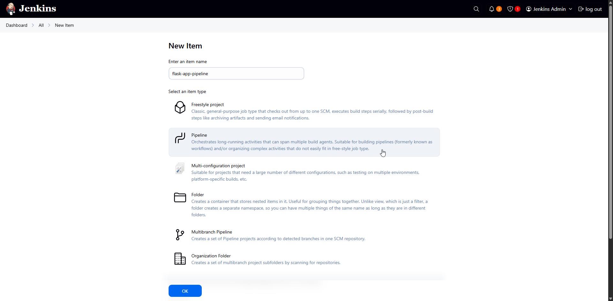
   *Image: Creating a new Jenkins pipeline*

3. **Configure Pipeline Source**:
   - In the pipeline configuration page, scroll down to the "Pipeline" section
   - Select "Pipeline script from SCM" from the "Definition" dropdown
   - Select "Git" from the "SCM" dropdown
   - Enter your Git repository URL in the "Repository URL" field
   - Configure credentials if needed
   - Specify the branch to build (e.g., "*/main")
   - Set "Script Path" to "jenkins/Jenkinsfile"

   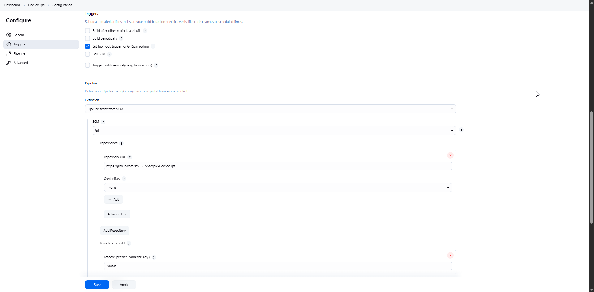
   *Image: Configuring pipeline source*

4. **Configure Build Triggers**:
   - Set up a webhook for immediate triggering

5. **Save the Pipeline Configuration**:
   - Click "Save" to create the pipeline

#### SonarQube Integration

To integrate SonarQube with Jenkins:

1. **Generate a SonarQube Token**:
   - Log in to SonarQube at `http://sonarqube.local` or `http://sonarqube.<YOUR_IP>.nip.io`
   - Go to "My Account" > "Security" tab
   - Enter a token name (e.g., "jenkins-integration")
   - Click "Generate"
   - Copy the generated token (it will only be shown once)

   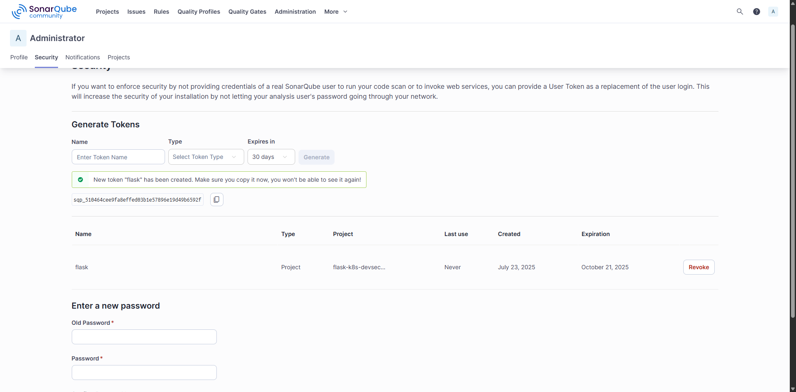
   *Image: Generating a SonarQube token*

2. **Add the Token to Jenkins**:
   - In Jenkins, go to "Manage Jenkins" > "Credentials" > "System" > "Global credentials" > "Add Credentials"
   - Select "Secret text" as the kind
   - Enter the SonarQube token in the "Secret" field
   - Set "ID" to "SONAR_TOKEN"
   - Add a description (e.g., "SonarQube Authentication Token")
   - Click "OK"

   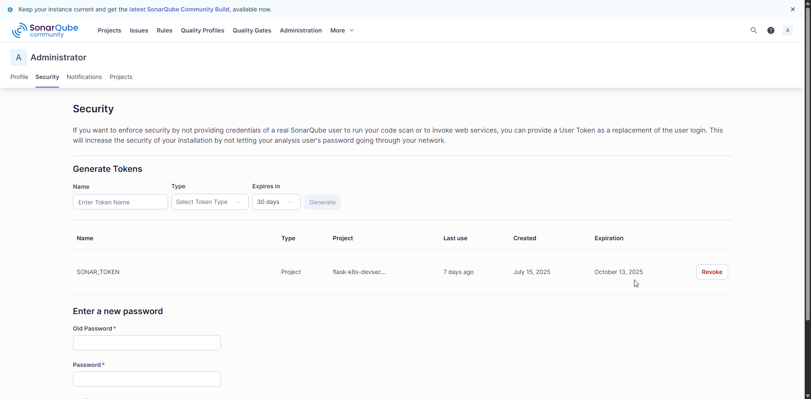
   *Image: Adding SonarQube token to Jenkins*


#### Understanding the CI/CD Pipeline

The Jenkinsfile defines a comprehensive CI/CD pipeline with the following stages:

1. **Checkout**: Retrieves the source code from the Git repository
2. **Install Dependencies**: Sets up a Python virtual environment and installs required packages
3. **Run Tests**: Executes unit tests with code coverage reporting
4. **SonarQube Analysis**: Performs static code analysis and uploads results to SonarQube
5. **Trivy FS Scan**: Scans the filesystem for vulnerabilities
6. **Build & Push Image**: Builds a Docker image and pushes it to the registry
7. **Trivy Image Scan**: Scans the Docker image for vulnerabilities
8. **Deploy to Kubernetes**: Updates the Kubernetes deployment with the new image

Key sections of the Jenkinsfile:

```groovy
// File: jenkins/Jenkinsfile (key sections)
pipeline {
    agent any

    environment {
        REGISTRY = 'localhost:32000'
        IMAGE_NAME = 'flask-k8s-app'
        TAG = "build-${env.BUILD_NUMBER}"
        SONAR_HOST_URL = "http://sonarqube-sonarqube.sonarqube:9000"
        SONAR_PROJECT_KEY = "flask-k8s-devsecops"
        SONAR_TOKEN = credentials('SONAR_TOKEN')
    }

    stages {
        // Stage definitions...
        
        stage('SonarQube Analysis') {
            steps {
                dir('app') {
                    sh '''
                        # Activate virtual environment
                        . venv/bin/activate
                        
                        # Run SonarQube analysis
                        sonar-scanner \
                            -Dsonar.projectKey=${SONAR_PROJECT_KEY} \
                            -Dsonar.sources=. \
                            -Dsonar.tests=tests \
                            -Dsonar.host.url=${SONAR_HOST_URL} \
                            -Dsonar.token=${SONAR_TOKEN} \
                            -Dsonar.python.coverage.reportPaths=coverage.xml \
                            -Dsonar.python.xunit.reportPath=test-results.xml \
                            -Dsonar.exclusions=**/*_test.py,**/test_*.py,**/__pycache__/**,**/venv/**
                    '''
                }
            }
        }
        
        // More stages...
    }
}
```

#### Customizing the Pipeline

To customize the CI/CD pipeline for your project:

1. **Update Environment Variables**:
   - Modify the `environment` section in the Jenkinsfile to match your project
   - Update `IMAGE_NAME` to your application name
   - Change `SONAR_PROJECT_KEY` to your project key

2. **Adjust Build Steps**:
   - Modify the `Install Dependencies` stage to install your project's dependencies
   - Update the `Run Tests` stage to use your project's test framework
   - Customize the `SonarQube Analysis` stage with your project's specific exclusions

3. **Configure Deployment**:
   - Update the `Deploy to Kubernetes` stage to target your application's namespace and deployment
   - Adjust resource limits and scaling parameters as needed


### 4.3 Security Tools Configuration

The DevSecOps platform integrates several security tools to ensure comprehensive protection throughout the development lifecycle. This section explains how to configure and use these security tools.

#### SonarQube Configuration

SonarQube provides static code analysis to identify code quality issues and security vulnerabilities.

##### SonarQube Project Configuration

The platform includes a default SonarQube project configuration:

```properties
# File: security/sonarqube/sonar-project.properties
sonar.projectKey=flask-k8s-devsecops
sonar.projectName=Flask K8s DevSecOps
sonar.projectVersion=1.0.0
sonar.sources=app
sonar.tests=app/tests
sonar.python.coverage.reportPaths=coverage.xml
sonar.python.xunit.reportPath=test-results.xml
sonar.exclusions=**/*_test.py,**/test_*.py,**/__pycache__/**,**/venv/**
sonar.coverage.exclusions=**/test_*.py,**/*_test.py
```

To customize SonarQube for your project:

1. **Update Project Information**:
   - Change `sonar.projectKey` to a unique identifier for your project
   - Modify `sonar.projectName` to your project's display name
   - Update `sonar.projectVersion` to match your project's version

2. **Configure Source and Test Directories**:
   - Adjust `sonar.sources` to point to your source code directory
   - Update `sonar.tests` to point to your test directory

3. **Set Exclusions**:
   - Modify `sonar.exclusions` to exclude files that shouldn't be analyzed
   - Update `sonar.coverage.exclusions` to exclude files from coverage calculations

##### SonarQube Quality Gates

To configure quality gates in SonarQube:

1. **Access SonarQube**:
   - Open SonarQube at `http://sonarqube.local` or `http://sonarqube.<YOUR_IP>.nip.io`
   - Log in with the default credentials (admin/admin)

2. **Create a Quality Gate**:
   - Go to "Quality Gates" in the top menu
   - Click "Create" to create a new quality gate
   - Name it (e.g., "DevSecOps Standard")

3. **Add Conditions**:
   - Click "Add Condition"
   - Select metrics such as:
     - Coverage: less than 80%
     - Duplicated Lines: greater than 3%
     - Security Hotspots: greater than 0
     - Vulnerabilities: greater than 0
   - Click "Save"

4. **Set as Default**:
   - Click "Set as Default" to apply this quality gate to all projects

   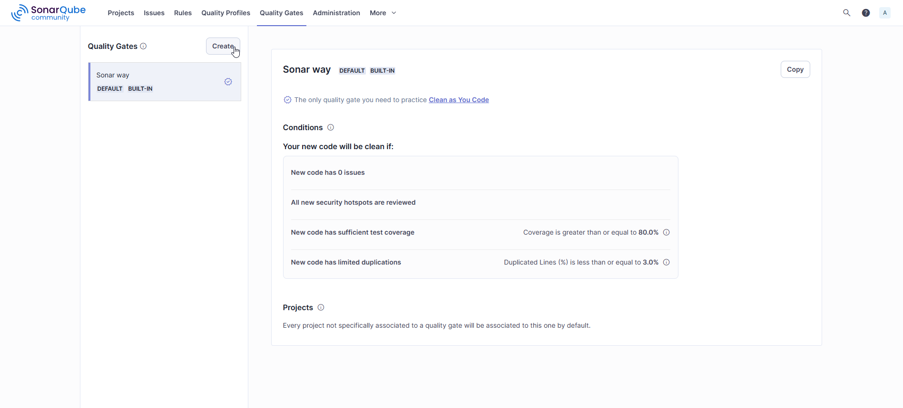
   *Image: Configuring a SonarQube quality gate*

#### Trivy Configuration

Trivy is used for scanning container images and filesystems for vulnerabilities.

##### Trivy Configuration File

The platform includes a default Trivy configuration:

```yaml
# File: security/trivy/trivy-config.yaml
format: sarif
exit-code: 1
severity: MEDIUM,HIGH,CRITICAL
vuln-type: os,library
security-checks: vuln,secret,config
db:
  skip-update: false
  light: false
cache:
  backend: fs
  ttl: 72h
timeout: 5m0s
skip-dirs:
  - node_modules/
  - .git/
  - __pycache__/
  - .pytest_cache/
  - venv/
  - .venv/
skip-files:
  - "*.pyc"
  - "*.pyo"
```

To customize Trivy for your project:

1. **Adjust Severity Levels**:
   - Modify `severity` to include or exclude certain severity levels (LOW, MEDIUM, HIGH, CRITICAL)

2. **Configure Security Checks**:
   - Update `security-checks` to enable or disable specific checks:
     - `vuln`: Vulnerability scanning
     - `secret`: Secret detection
     - `config`: Misconfigurations

3. **Set Exclusions**:
   - Modify `skip-dirs` and `skip-files` to exclude directories and files from scanning

##### Running Trivy Scans Manually

To run Trivy scans outside the CI/CD pipeline:

1. **Filesystem Scan**:
   ```bash
   trivy fs --config security/trivy/trivy-config.yaml .
   ```

2. **Image Scan**:
   ```bash
   trivy image --config security/trivy/trivy-config.yaml localhost:32000/flask-k8s-app:latest
   ```

3. **Config Scan**:
   ```bash
   trivy config --config security/trivy/trivy-config.yaml .
   ```

#### Kubernetes Audit Policy

The platform includes a Kubernetes audit policy to monitor security-relevant events:

```yaml
# File: siem/configs/audit-policy.yaml (key sections)
apiVersion: audit.k8s.io/v1
kind: Policy
rules:
  # Log security-sensitive events at RequestResponse level
  - level: RequestResponse
    resources:
    - group: ""
      resources: ["secrets", "serviceaccounts"]
    - group: "rbac.authorization.k8s.io"
      resources: ["roles", "rolebindings", "clusterroles", "clusterrolebindings"]
  
  # Log pod and deployment changes at Metadata level
  - level: Metadata
    resources:
    - group: ""
      resources: ["pods", "pods/exec", "pods/portforward", "pods/proxy"]
    - group: "apps"
      resources: ["deployments", "replicasets", "daemonsets", "statefulsets"]
  
  # More rules...
```

To customize the audit policy:

1. **Adjust Audit Levels**:
   - `None`: Don't log events
   - `Metadata`: Log request metadata (user, timestamp, resource, verb)
   - `Request`: Log event metadata and request body
   - `RequestResponse`: Log event metadata, request and response bodies

2. **Configure Resources to Monitor**:
   - Add or remove resources from the rules based on your security requirements
   - Focus on security-sensitive resources like secrets, RBAC, and network policies

3. **Apply the Updated Policy**:
   ```bash
   microk8s kubectl apply -f siem/configs/audit-policy.yaml
   ```

#### Advanced SIEM Integration

The platform integrates comprehensive security monitoring with multiple layers of threat detection and prevention:

##### Security Tools Included

1. **Fail2Ban**: Intrusion prevention system that monitors log files and bans IPs with suspicious activity
2. **AIDE**: Advanced Intrusion Detection Environment for file integrity monitoring
3. **ClamAV**: Open-source antivirus engine for malware detection
4. **RKHunter**: Rootkit detection tool for identifying malicious software
5. **Lynis**: Security auditing tool for system hardening assessment
6. **Network Monitoring**: Custom scripts for detecting network anomalies and port scans
7. **Host Intrusion Detection**: Lightweight HIDS for monitoring system behavior
8. **Auditd**: Comprehensive system audit logging

##### Deploying the Enhanced SIEM Stack

To deploy the comprehensive SIEM stack:

```bash
# Using the setup script
./setup.sh
# Select option 5) Deploy SIEM Security Monitoring

# Or using Ansible directly
cd ansible
ansible-playbook -i inventory siem.yml --ask-become-pass
```

##### Security Monitoring Features

The enhanced SIEM implementation provides:

**Real-time Threat Detection:**
- SSH brute force attack prevention (Fail2Ban)
- File integrity violations (AIDE)
- Malware and virus detection (ClamAV)
- Rootkit detection (RKHunter)
- Network anomaly detection
- Suspicious process monitoring

**Automated Security Scanning:**
- Daily virus scans
- Weekly rootkit detection
- Weekly security audits
- Continuous file integrity monitoring
- Real-time network monitoring

**Severity-Based Alerting:**
- **Critical**: Malware detection, rootkits, security breaches
- **High**: Failed authentication attempts, unauthorized access
- **Medium**: Configuration changes, unusual network activity
- **Low**: Informational events, successful operations

**Security Dashboard Features:**
- 🚨 Critical security alerts counter
- ⚠️ High severity events tracking
- 🛡️ Fail2Ban active blocks display
- 🔍 Security tools status monitoring
- 🔥 Real-time threat indicators table
- 📊 Security metrics timeline with severity levels

##### Manual Security Operations

Execute security scans manually:

```bash
# Check Fail2Ban status
sudo fail2ban-client status

# Run file integrity check
sudo /usr/local/bin/aide-check.sh

# Perform antivirus scan
sudo /usr/local/bin/clamav-scan.sh

# Check for rootkits
sudo /usr/local/bin/rkhunter-scan.sh

# Run security audit
sudo /usr/local/bin/lynis-audit.sh

# View security logs
tail -f /var/log/siem/*.log
```

##### Security Log Locations

- **SIEM Events**: `/var/log/siem/`
- **Fail2Ban**: `/var/log/fail2ban.log`
- **AIDE**: `/var/log/aide/`
- **ClamAV**: `/var/log/clamav/`
- **RKHunter**: `/var/log/rkhunter/`
- **Lynis**: `/var/log/lynis/`
- **System Audit**: `/var/log/audit/audit.log`


### 4.4 Monitoring Setup

The DevSecOps platform includes a comprehensive monitoring stack based on Loki, Grafana Alloy, and Grafana. This section explains how to configure and use the monitoring components.

#### Monitoring Architecture

The monitoring stack consists of the following components:

1. **Grafana Alloy**: Unified collector for logs, metrics, and traces
2. **Loki**: Log storage and querying
3. **Grafana**: Visualization and dashboarding

The components work together to provide a complete observability solution:

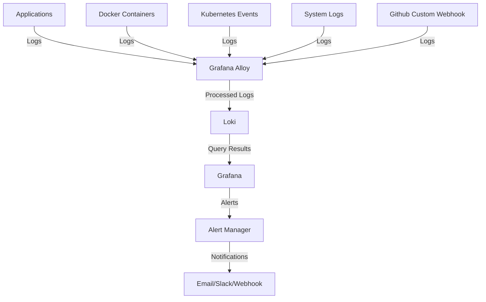

#### Grafana Alloy Configuration

Grafana Alloy is configured to collect logs from various sources and process them before sending to Loki.

##### Docker Environment Configuration

For the Docker Compose environment, Alloy is configured to collect logs from Docker containers:

```river
# File: monitoring/alloy/docker-config.alloy (key sections)
// Discover all Docker containers
discovery.docker "containers" {
	host = "unix:///var/run/docker.sock"
	refresh_interval = "5s"
}

// Relabel Docker containers for log collection
discovery.relabel "docker_containers" {
	targets = discovery.docker.containers.targets
	
	// Only collect logs from containers with specific labels
	rule {
		source_labels = ["__meta_docker_container_name"]
		regex = "(webhook|flask-app|jenkins|sonarqube).*"
		action = "keep"
	}
	
	// More rules...
}

// Collect Docker container logs
loki.source.docker "containers" {
	host = "unix:///var/run/docker.sock"
	targets = discovery.relabel.docker_containers.output
	forward_to = [loki.process.docker_logs.receiver]
	refresh_interval = "5s"
}

// Process Docker container logs
loki.process "docker_logs" {
	forward_to = [loki.write.default.receiver]
	
	// Parse JSON logs if possible
	stage.json {
		expressions = {
			timestamp = "timestamp",
			level = "level", 
			message = "message",
			event_type = "event_type",
			source_ip = "source_ip",
		}
	}
	
	// More stages...
}
```

##### SIEM Configuration

For the Kubernetes environment, Alloy is configured to collect and process security-related logs:

```river
# File: monitoring/alloy/siem-config.alloy (key sections)
// Kubernetes pod discovery for API events
discovery.kubernetes "pods" {
	role = "pod"
}

discovery.relabel "kubernetes_pods" {
	targets = discovery.kubernetes.pods.targets
	rule {
		source_labels = ["__meta_kubernetes_pod_phase"]
		regex = "Pending|Succeeded|Failed|Completed"
		action = "drop"
	}
	// More rules...
}

// Kubernetes pod logs collection
loki.source.kubernetes "pods" {
	targets    = discovery.relabel.kubernetes_pods.output
	forward_to = [loki.process.k8s_api_logs.receiver]
}

// Process Kubernetes API logs
loki.process "k8s_api_logs" {
	forward_to = [loki.write.default.receiver]
	
	// Add Kubernetes-specific labels
	stage.labels {
		values = {
			job = "loki.source.kubernetes.pods",
			event_type = "k8s_event",
			log_source = "kubernetes",
		}
	}
	
	// Process security-related Kubernetes events
	stage.match {
		selector = "{job=\"loki.source.kubernetes.pods\"}"
		
		// Mark error events
		stage.match {
			selector = "{job=\"loki.source.kubernetes.pods\"} |~ \"(?i)(error|fail|exception|panic|fatal)\""
			// More stages...
		}
		
		// More match stages...
	}
}
```

To customize Alloy configuration:

1. **Edit the Configuration Files**:
   - Modify `monitoring/alloy/docker-config.alloy` for Docker environment
   - Modify `monitoring/alloy/siem-config.alloy` for Kubernetes environment

2. **Apply the Changes**:
   ```bash
   # For Docker environment
   docker compose restart alloy
   
   # For Kubernetes environment
   microk8s kubectl create configmap -n monitoring alloy-config --from-file=monitoring/alloy/siem-config.alloy --dry-run=client -o yaml | microk8s kubectl apply -f -
   microk8s kubectl rollout restart -n monitoring deployment/alloy
   ```


#### Setting Up Webhook Integration

The platform includes a webhook receiver service that can trigger Jenkins builds when changes are pushed to your Git repository:

1. **Verify Webhook Receiver**:
   - Check that the webhook receiver is running:
     ```bash
     microk8s kubectl get pods -n monitoring -l app=webhook-receiver
     ```

2. **Configure Ingress for Webhook Receiver**:
   - Create an ingress for the webhook receiver:
     ```yaml
     # File: webhook-ingress.yaml
     apiVersion: networking.k8s.io/v1
     kind: Ingress
     metadata:
       name: webhook-ingress
       namespace: monitoring
       annotations:
         kubernetes.io/ingress.class: "nginx"
         nginx.ingress.kubernetes.io/rewrite-target: /
     spec:
       rules:
       - host: webhook.local
         http:
           paths:
           - path: /
             pathType: Prefix
             backend:
               service:
                 name: webhook-receiver-service
                 port:
                   number: 80
     ```

   - Apply the ingress:
     ```bash
     microk8s kubectl apply -f webhook-ingress.yaml
     ```

3. **Configure GitHub Webhook**:
   - Go to your GitHub repository
   - Click on "Settings" > "Webhooks" > "Add webhook"
   - Set the Payload URL to `http://webhook.<YOUR_IP>.nip.io/webhook`
   - Set the Content type to `application/json`
   - Select "Just the push event" (or customize as needed)
   - Click "Add webhook"

   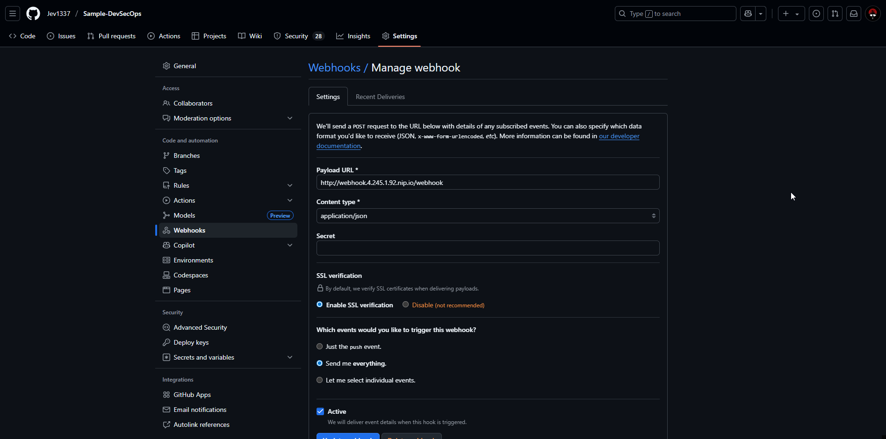
   *Image: Configuring GitHub webhook*


#### Webhook Receiver Architecture

The webhook receiver service processes Git webhook events and forwards them to Jenkins:

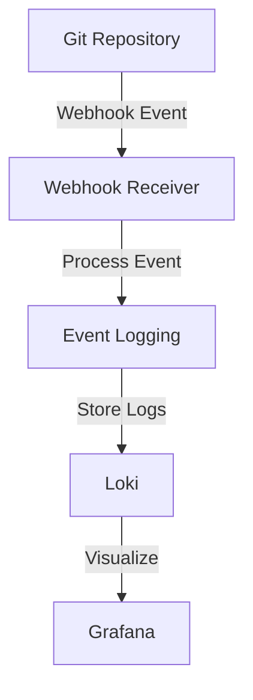

The webhook receiver:

1. Receives webhook events from Git repositories
2. Extracts relevant information from the payload
3. Logs the event to Loki 
4. Visualize in Grafana for monitoring


#### Loki Configuration

Loki is configured to store and index logs efficiently. The platform uses a single-binary deployment of Loki for simplicity.

Key Loki configuration parameters:

```yaml
# Loki configuration (simplified)
deploymentMode: SingleBinary
loki:
  auth_enabled: false
  commonConfig:
    replication_factor: 1
  limits_config:
    max_streams_per_user: 10000
    max_line_size: 256000
    max_entries_limit_per_query: 5000
    max_global_streams_per_user: 10000
    ingestion_rate_mb: 50
    ingestion_burst_size_mb: 100
  storage:
    type: 'filesystem'
    filesystem:
      chunks_directory: /var/loki/chunks
      rules_directory: /var/loki/rules
```

To customize Loki configuration:

1. **Create a Custom Values File**:
   ```yaml
   # custom-loki-values.yaml
   loki:
     limits_config:
       max_streams_per_user: 20000
       ingestion_rate_mb: 100
   ```

2. **Apply the Changes**:
   ```bash
   microk8s helm3 upgrade -n monitoring loki grafana/loki -f custom-loki-values.yaml
   ```

#### Grafana Configuration

Grafana is configured to visualize logs and metrics from Loki and other sources.

##### Grafana Ingress

The platform includes an ingress configuration for Grafana:

```yaml
# File: monitoring/grafana/ingress.yaml
apiVersion: networking.k8s.io/v1
kind: Ingress
metadata:
  name: grafana-ingress
  namespace: monitoring
  annotations:
    kubernetes.io/ingress.class: "nginx"
    nginx.ingress.kubernetes.io/rewrite-target: /
    nginx.ingress.kubernetes.io/ssl-redirect: "false"
spec:
  rules:
  - host: grafana.local
    http:
      paths:
      - path: /
        pathType: Prefix
        backend:
          service:
            name: grafana
            port:
              number: 3000
```

To customize the Grafana ingress:

1. **Edit the Ingress Configuration**:
   - Modify `host` to your preferred domain name
   - Add TLS configuration for HTTPS

2. **Apply the Changes**:
   ```bash
   microk8s kubectl apply -f monitoring/grafana/ingress.yaml
   ```

##### Grafana Dashboards

The platform includes pre-configured dashboards for monitoring:

1. **Application Logs Dashboard**: Visualizes logs from the Flask application
2. **Security Dashboard**: Displays security-related events
3. **SIEM Dashboard**: Provides a comprehensive security monitoring view

To access the dashboards:

1. **Open Grafana**:
   - Navigate to `http://grafana.local` or `http://grafana.<YOUR_IP>.nip.io`
   - Log in with the default credentials (admin/admin123)

2. **Browse Dashboards**:
   - Click on "Dashboards" in the left sidebar
   - Select a dashboard from the list
   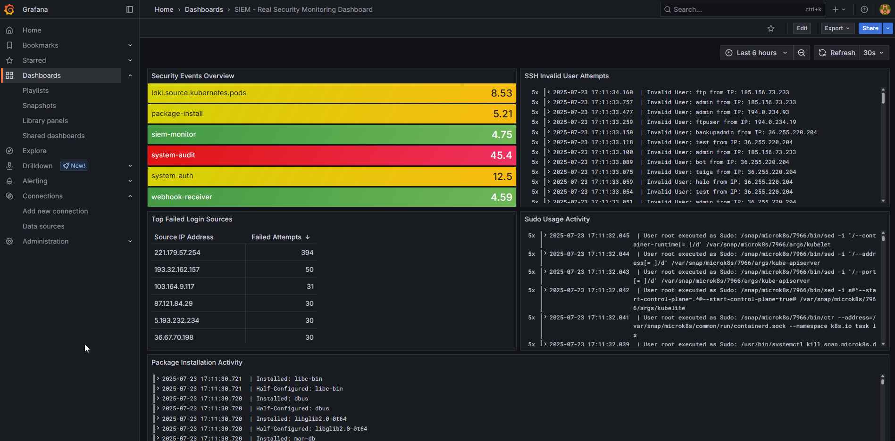
   *Image: Grafana SIEM dashboard*


##### Creating Custom Dashboards

To create a custom dashboard:

1. **Create a New Dashboard**:
   - Click on "Create" > "Dashboard" in the left sidebar
   - Click "Add visualization"

2. **Configure Data Source**:
   - Select "Loki" as the data source
   - Enter a LogQL query (e.g., `{job="flask-app"}`)

3. **Configure Visualization**:
   - Select the visualization type (e.g., logs, graph, table)
   - Configure display options
   - Click "Apply"

4. **Save the Dashboard**:
   - Click the save icon in the top right
   - Enter a name and description
   - Click "Save"

#### LogQL Queries

Loki uses LogQL for querying logs. Here are some useful queries for monitoring:

1. **View Application Logs**:
   ```logql
   {job="flask-app"}
   ```

2. **Filter by Log Level**:
   ```logql
   {job="flask-app"} |= "ERROR"
   ```

3. **Extract Fields**:
   ```logql
   {job="flask-app"} | json | level="error"
   ```

4. **Count Errors by Time**:
   ```logql
   sum(count_over_time({job="flask-app", level="error"}[5m])) by (container)
   ```

5. **Security Events**:
   ```logql
   {event_type=~"auth_failure|access_denied|anonymous_access"}
   ```


## 5. Usage Guide

### 5.1 Deploying Applications

The DevSecOps platform provides a streamlined process for deploying applications to Kubernetes. This section explains how to deploy applications using both the CI/CD pipeline and manual methods.

#### Application Structure

The platform includes a sample Flask application that demonstrates best practices for containerized applications:

```
app/
├── app.py                # Main application code
├── Dockerfile            # Container definition
├── requirements.txt      # Python dependencies
└── tests/                # Unit tests
```

Key features of the sample application:

- **Structured JSON logging**: Logs are formatted as JSON for easy parsing
- **Prometheus metrics**: Application exposes metrics for monitoring
- **Kubernetes health checks**: Health endpoint for liveness and readiness probes
- **Request tracing**: Each request has a unique ID for tracing
- **Error handling**: Comprehensive error handling and reporting
- **Security headers**: Secure HTTP headers for protection

#### Deploying via CI/CD Pipeline

The recommended way to deploy applications is through the CI/CD pipeline:

1. **Push Code to Repository**:
   - Commit your changes to the Git repository
   - Push the changes to the remote repository

2. **Monitor Pipeline Execution**:
   - Open Jenkins at `http://jenkins.local` or `http://jenkins.<YOUR_IP>.nip.io`
   - Navigate to your pipeline
   - Monitor the build progress

   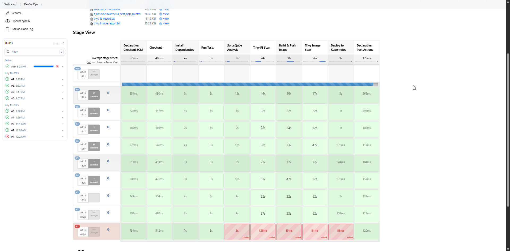
   *Image: Jenkins pipeline execution*

3. **Verify Deployment**:
   - Once the pipeline completes, verify the deployment:
     ```bash
     microk8s kubectl get pods -n flask-app
     ```
   - Check the application logs:
     ```bash
     microk8s kubectl logs -n flask-app deployment/flask-app
     ```
   - Access the application at `http://flask-app.local` or `http://app.<YOUR_IP>.nip.io`

#### Manual Deployment Process

For development or testing purposes, you can deploy the application manually:

1. **Build the Docker Image**:
   ```bash
   cd app
   docker build -t localhost:32000/flask-k8s-app:latest .
   ```

2. **Push the Image to the Registry**:
   ```bash
   docker push localhost:32000/flask-k8s-app:latest
   ```

3. **Deploy to Kubernetes**:
   ```bash
   # Apply Kubernetes resources
   microk8s kubectl apply -f k8s/namespace.yaml
   microk8s kubectl apply -f k8s/configmap.yaml
   microk8s kubectl apply -f k8s/secret.yaml
   microk8s kubectl apply -f k8s/deployment.yaml
   microk8s kubectl apply -f k8s/service.yaml
   microk8s kubectl apply -f k8s/ingress.yaml
   ```

4. **Verify the Deployment**:
   ```bash
   # Check deployment status
   microk8s kubectl get deployment -n flask-app
   
   # Check pods
   microk8s kubectl get pods -n flask-app
   
   # Check service
   microk8s kubectl get service -n flask-app
   
   # Check ingress
   microk8s kubectl get ingress -n flask-app
   ```

#### Customizing the Application

To customize the application for your needs:

1. **Modify the Application Code**:
   - Edit `app/app.py` to implement your business logic
   - Update `app/requirements.txt` with additional dependencies

2. **Update the Dockerfile**:
   - Modify `app/Dockerfile` to include any additional build steps
   - Adjust environment variables and runtime configuration

3. **Update Kubernetes Resources**:
   - Modify `k8s/configmap.yaml` with your application configuration
   - Update `k8s/deployment.yaml` with resource requirements and scaling parameters
   - Adjust `k8s/ingress.yaml` with your domain name

#### Scaling the Application

The application can be scaled horizontally to handle increased load:

1. **Manual Scaling**:
   ```bash
   microk8s kubectl scale deployment flask-app -n flask-app --replicas=5
   ```

2. **Automatic Scaling with HPA**:
   The platform includes a Horizontal Pod Autoscaler (HPA) configuration:
   ```bash
   microk8s kubectl apply -f k8s/hpa.yaml
   ```

   This will automatically scale the application based on CPU and memory usage:
   ```yaml
   # File: k8s/hpa.yaml (key sections)
   apiVersion: autoscaling/v2
   kind: HorizontalPodAutoscaler
   metadata:
     name: flask-app-hpa
     namespace: flask-app
   spec:
     minReplicas: 2
     maxReplicas: 10
     metrics:
     - type: Resource
       resource:
         name: cpu
         target:
           type: Utilization
           averageUtilization: 70
   ```

#### Monitoring Application Deployment

To monitor the application deployment:

1. **Check Deployment Status**:
   ```bash
   microk8s kubectl get deployment flask-app -n flask-app -o wide
   ```

2. **View Pod Status**:
   ```bash
   microk8s kubectl get pods -n flask-app
   ```

3. **Check Application Logs**:
   ```bash
   microk8s kubectl logs -n flask-app deployment/flask-app
   ```

4. **View Events**:
   ```bash
   microk8s kubectl get events -n flask-app
   ```

5. **Access Metrics**:
   - Open Grafana at `http://grafana.local` or `http://grafana.<YOUR_IP>.nip.io`
   - Navigate to the "Application Logs" dashboard

#### Troubleshooting Deployment Issues

Common deployment issues and solutions:

1. **Image Pull Errors**:
   - Verify the image exists in the registry:
     ```bash
     curl -X GET http://localhost:32000/v2/flask-k8s-app/tags/list
     ```
   - Check image pull secrets if using a private registry

2. **Pod Startup Failures**:
   - Check pod status:
     ```bash
     microk8s kubectl describe pod -n flask-app -l app=flask-app
     ```
   - View container logs:
     ```bash
     microk8s kubectl logs -n flask-app -l app=flask-app
     ```

3. **Application Errors**:
   - Check application logs:
     ```bash
     microk8s kubectl logs -n flask-app deployment/flask-app
     ```
   - Verify environment variables:
     ```bash
     microk8s kubectl exec -n flask-app -it $(microk8s kubectl get pod -n flask-app -l app=flask-app -o jsonpath='{.items[0].metadata.name}') -- env
     ```

4. **Ingress Issues**:
   - Verify ingress controller is running:
     ```bash
     microk8s kubectl get pods -n ingress
     ```
   - Check ingress configuration:
     ```bash
     microk8s kubectl describe ingress -n flask-app flask-app-ingress
     ```
   - Verify DNS resolution:
     ```bash
     nslookup flask-app.local 127.0.0.1
     ```

## 6. Integration Guide

### 6.1 Jenkins and SonarQube Integration

Integrating Jenkins with SonarQube is a critical component of the DevSecOps platform, enabling continuous code quality and security analysis. This section provides detailed instructions for setting up and configuring this integration.

#### Integration Architecture

The Jenkins and SonarQube integration works as follows:

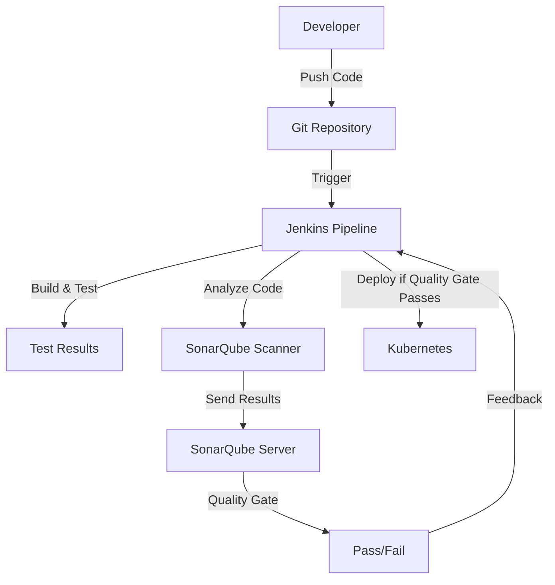

#### Prerequisites

Before setting up the integration, ensure:

1. **Jenkins is running**:
   ```bash
   microk8s kubectl get pods -n jenkins
   ```

2. **SonarQube is running**:
   ```bash
   microk8s kubectl get pods -n sonarqube
   ```

3. **Both services are accessible**:
   - Jenkins: `http://jenkins.local` or `http://jenkins.<YOUR_IP>.nip.io`
   - SonarQube: `http://sonarqube.local` or `http://sonarqube.<YOUR_IP>.nip.io`


#### Step 1: Create a SonarQube Project

Before running the analysis, you need to create a project in SonarQube:

1. **Access SonarQube**:
   - Open SonarQube at `http://sonarqube.local` or `http://sonarqube.<YOUR_IP>.nip.io`
   - Log in with the default credentials (admin/admin)
   - If this is your first login, you'll be prompted to change the password

2. **Create a New Project**:
   - Click "Create new project"
   - Select "Manually"
   - Enter a project key (e.g., "flask-k8s-devsecops")
   - Enter a display name (e.g., "Flask K8s DevSecOps")
   - Click "Set Up"

3. **Set Up Analysis Method**:
   - Select "Locally"
   - Generate a token and copy it
   - You'll use this token in your CI/CD pipeline

   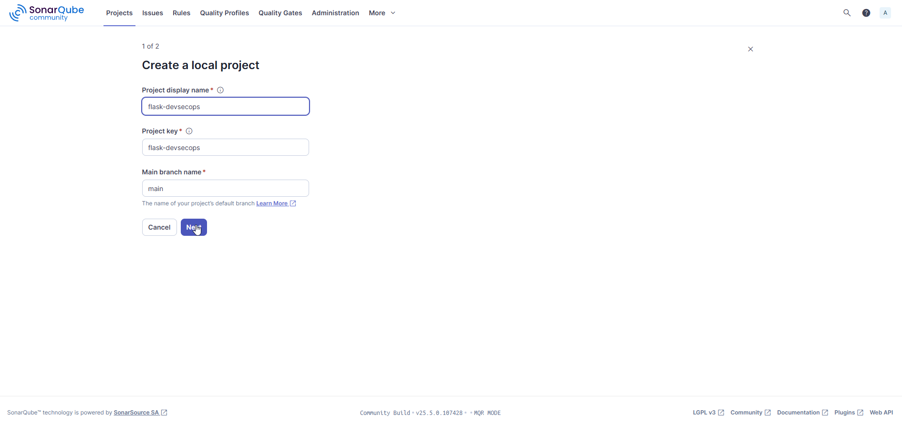
   *Image: Creating a SonarQube project*

> **Note**: Our project uses the SonarQube CLI directly in the Jenkins pipeline rather than the Jenkins SonarQube plugin. If you prefer to use the plugin, you can configure the SonarQube server in Jenkins by installing the SonarQube Scanner plugin and adding the server configuration in "Manage Jenkins" > "System" > "SonarQube servers".

#### Step 2: Generate a SonarQube Token

First, you need to generate a token in SonarQube for Jenkins authentication:

1. **Access SonarQube**:
   - Open SonarQube at `http://sonarqube.local` or `http://sonarqube.<YOUR_IP>.nip.io`
   - Log in with the default credentials (admin/admin)
   - If this is your first login, you'll be prompted to change the password

2. **Generate a Token**:
   - Click on your profile icon in the top-right corner
   - Select "My Account"
   - Click on the "Security" tab
   - Enter a token name (e.g., "jenkins-integration")
   - Click "Generate"
   - **Important**: Copy the generated token immediately, as it will only be shown once

   
   *Image: Generating a SonarQube token*


#### Step 3: Add the SonarQube Token to Jenkins

Next, add the SonarQube token as a credential in Jenkins:

1. **Access Jenkins**:
   - Open Jenkins at `http://jenkins.local` or `http://jenkins.<YOUR_IP>.nip.io`
   - Log in with the default credentials (admin/password from setup)

2. **Navigate to Credentials**:
   - Click on "Manage Jenkins" in the left sidebar
   - Click on "Credentials"
   - Click on "System"
   - Click on "Global credentials (unrestricted)"
   - Click on "Add Credentials"

3. **Add the SonarQube Token**:
   - Select "Secret text" from the "Kind" dropdown
   - Enter the SonarQube token in the "Secret" field
   - Enter "SONAR_TOKEN" in the "ID" field
   - Enter "SonarQube Authentication Token" in the "Description" field
   - Click "OK"

   
   *Image: Adding SonarQube token to Jenkins*

#### Step 4: Configure SonarQube Quality Gates

Quality Gates in SonarQube define the criteria that your code must meet to be considered ready for production:

1. **Access Quality Gates**:
   - In SonarQube, go to "Quality Gates" in the top menu
   - Click "Create" to create a new quality gate
   - Enter a name (e.g., "DevSecOps Standard")

2. **Add Conditions**:
   - Click "Add Condition"
   - Select metrics such as:
     - Coverage: less than 80%
     - Duplicated Lines: greater than 3%
     - Security Hotspots: greater than 0
     - Vulnerabilities: greater than 0
   - Click "Save"

3. **Set as Default**:
   - Click "Set as Default" to apply this quality gate to all projects

   
   *Image: Configuring a SonarQube quality gate*

#### Step 5: Run the Pipeline and Verify Integration

Now, run the Jenkins pipeline and verify the SonarQube integration:

1. **Run the Pipeline**:
   - In Jenkins, navigate to your pipeline
   - Click "Build Now"

2. **Monitor the Build**:
   - Click on the build number to view the build details
   - Click on "Console Output" to view the build logs
   - Verify that the SonarQube analysis is running

3. **Check SonarQube Results**:
   - Once the build completes, go to SonarQube
   - Navigate to your project
   - View the analysis results
   - Check if the quality gate passed or failed

   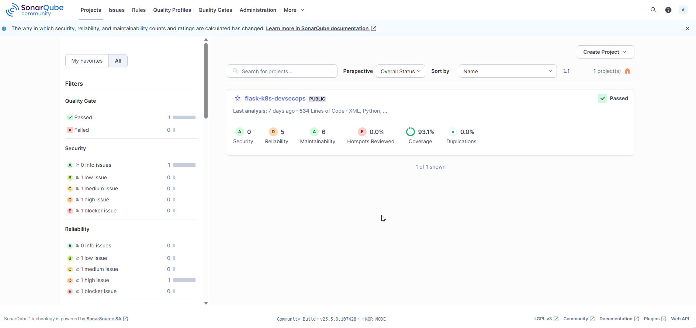
   *Image: SonarQube analysis results*


### 6.2 Git SCM Polling Configuration

Configuring Git SCM polling enables automatic triggering of Jenkins pipelines when changes are pushed to your Git repository. This section explains how to set up both polling and webhook-based triggers.

#### Git SCM Polling Methods

There are two main methods for triggering Jenkins builds from Git repositories:

1. **SCM Polling**: Jenkins periodically checks the repository for changes
2. **Webhooks**: The Git repository notifies Jenkins when changes occur

Each method has its advantages:

| Method | Advantages | Disadvantages |
|--------|------------|---------------|
| **SCM Polling** | - Simple to set up<br>- Works with any Git repository<br>- No external access required | - Delay between changes and builds<br>- Increased load on Jenkins<br>- Inefficient resource usage |
| **Webhooks** | - Immediate triggering<br>- Reduced load on Jenkins<br>- More efficient | - Requires external access to Jenkins<br>- More complex setup<br>- Requires webhook support in Git |

#### Setting Up GitHub Webhook in Jenkins

Our Jenkins setup is configured to automatically receive webhook events from GitHub without the need for manual SCM polling configuration:

1. **Access Jenkins**:
   - Open Jenkins at `http://jenkins.local` or `http://jenkins.<YOUR_IP>.nip.io`
   - Log in with the default credentials (admin/password from setup)

2. **Configure Pipeline**:
   - Navigate to your pipeline
   - Click "Configure" in the left sidebar

3. **Webhook Configuration**:
   - The webhook URL is automatically set to `http://jenkins.<YOUR_IP>.nip.io/github-webhook/`
   - No manual cron configuration is needed as the system uses webhooks for immediate triggering

   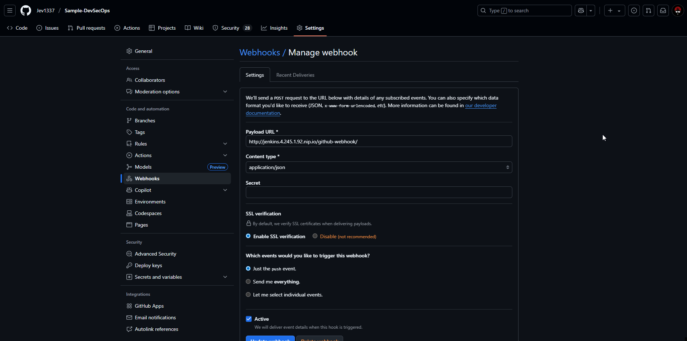
   *Image: Jenkins GitHub webhook configuration*

> **Note**: Using webhooks is more efficient than SCM polling as it triggers builds immediately when changes are pushed to the repository, rather than periodically checking for changes.


### 6.3 Security Tool Integration

The DevSecOps platform integrates a comprehensive suite of security tools providing multi-layered protection from development to production.

#### Security Tools Overview

The platform includes the following security tools:

**Development & Build Security:**
1. **SonarQube**: Static code analysis for code quality and security vulnerabilities
2. **Trivy**: Container and filesystem vulnerability scanning

**Runtime Security:**
3. **Fail2Ban**: Real-time intrusion prevention and IP blocking
4. **AIDE**: File integrity monitoring and change detection
5. **ClamAV**: Antivirus scanning and malware detection
6. **RKHunter**: Rootkit and backdoor detection
7. **Lynis**: Security auditing and system hardening assessment

**Infrastructure Security:**
8. **Kubernetes Security**: RBAC, security contexts, and audit policies
9. **Network Monitoring**: Port scan detection and network anomaly monitoring
10. **Host Intrusion Detection**: System behavior monitoring and threat detection

**Monitoring & SIEM:**
11. **Loki + Grafana**: Centralized security event monitoring and alerting
12. **Enhanced SIEM Dashboard**: Real-time threat visualization with severity indicators

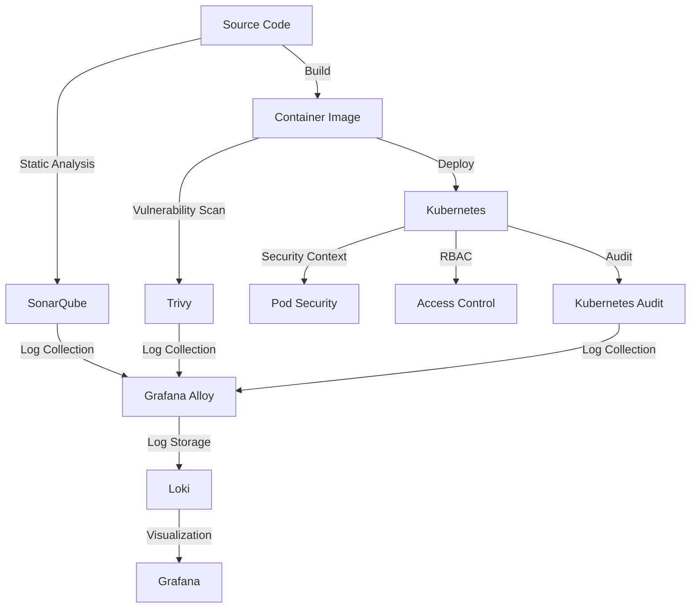

#### Trivy Integration

Trivy is integrated into the CI/CD pipeline to scan container images and filesystems for vulnerabilities.

##### Trivy Configuration

The platform includes a default Trivy configuration:

```yaml
# File: security/trivy/trivy-config.yaml
format: sarif
exit-code: 1
severity: MEDIUM,HIGH,CRITICAL
vuln-type: os,library
security-checks: vuln,secret,config
db:
  skip-update: false
  light: false
cache:
  backend: fs
  ttl: 72h
timeout: 5m0s
skip-dirs:
  - node_modules/
  - .git/
  - __pycache__/
  - .pytest_cache/
  - venv/
  - .venv/
skip-files:
  - "*.pyc"
  - "*.pyo"
```

To customize Trivy configuration:

1. **Edit the Configuration File**:
   - Modify `security/trivy/trivy-config.yaml` with your desired settings
   - Adjust severity levels, scan types, and exclusions

2. **Apply the Changes**:
   - Update the Jenkins pipeline to use the new configuration
   - Rebuild the Jenkins image if necessary

##### Trivy in the CI/CD Pipeline

Trivy is integrated into the Jenkins pipeline in two stages:

1. **Filesystem Scan**:
   ```groovy
   // File: jenkins/Jenkinsfile (Trivy FS scan section)
   stage('Trivy FS Scan') {
       steps {
           sh "trivy fs --format table -o trivy-fs-report.txt --severity HIGH,CRITICAL ."
           archiveArtifacts artifacts: 'trivy-fs-report.txt', allowEmptyArchive: true
       }
   }
   ```

2. **Image Scan**:
   ```groovy
   // File: jenkins/Jenkinsfile (Trivy image scan section)
   stage('Trivy Image Scan') {
       steps {
           script {
               def fullImageName = "${env.REGISTRY}/${env.IMAGE_NAME}:${env.TAG}"
               def buildNumber = env.BUILD_NUMBER
               
               sh """
                   # Run Trivy scan in a separate pod with host network access
                   python3 << 'PYEOF'
   import time
   from kubernetes import client, config

   # Load in-cluster config
   config.load_incluster_config()

   # Create API clients
   v1 = client.CoreV1Api()

   # Create Trivy scan pod with host network
   trivy_pod = {
       'apiVersion': 'v1',
       'kind': 'Pod',
       'metadata': {
           'name': 'trivy-scan-${buildNumber}',
           'namespace': 'jenkins'
       },
       'spec': {
           'restartPolicy': 'Never',
           'hostNetwork': True,  # Access to localhost:32000
           'containers': [{
               'name': 'trivy',
               'image': 'aquasec/trivy:latest',
               'command': ['trivy'],
               'args': [
                   'image',
                   '--format', 'table',
                   '--severity', 'HIGH,CRITICAL',
                   '--insecure',
                   '--timeout', '5m',
                   '${fullImageName}'
               ],
               'volumeMounts': [{
                   'name': 'scan-results',
                   'mountPath': '/results'
               }]
           }],
           'volumes': [{
               'name': 'scan-results',
               'emptyDir': {}
           }]
       }
   }

   # Create and run the pod
   # ...
   PYEOF
               """
           }
           archiveArtifacts artifacts: 'trivy-image-report.txt', allowEmptyArchive: true
       }
   }
   ```

##### Customizing Trivy Scans

To customize Trivy scans in the pipeline:

1. **Adjust Severity Levels**:
   - Modify the `--severity` flag to include or exclude certain severity levels
   - Options: `UNKNOWN`, `LOW`, `MEDIUM`, `HIGH`, `CRITICAL`

2. **Change Scan Types**:
   - Modify the `--vuln-type` flag to specify vulnerability types
   - Options: `os`, `library`, `all`

3. **Configure Exit Behavior**:
   - Set `--exit-code` to control whether the scan fails the build
   - `0`: Always exit with code 0
   - `1`: Exit with code 1 if vulnerabilities are found

4. **Add Custom Policies**:
   - Create custom Trivy policies in OPA Rego format
   - Add them to the scan with `--policy-namespace` and `--policy`

#### Kubernetes Security Integration

The platform includes several Kubernetes security features:

##### 1. Pod Security Context

The application deployment includes security context settings:

```yaml
# File: k8s/deployment.yaml (security context section)
securityContext:
  allowPrivilegeEscalation: false
  runAsNonRoot: true
  runAsUser: 1001
  runAsGroup: 1001
  readOnlyRootFilesystem: false
  capabilities:
    drop:
    - ALL
```

To customize the security context:

1. **Edit the Deployment File**:
   - Modify `k8s/deployment.yaml` with your desired security settings
   - Adjust user/group IDs, capabilities, and privileges

2. **Apply the Changes**:
   ```bash
   microk8s kubectl apply -f k8s/deployment.yaml
   ```

##### 2. RBAC Configuration

The platform includes RBAC configuration for Jenkins:

```yaml
# File: k8s/jenkins-rbac.yaml
apiVersion: rbac.authorization.k8s.io/v1
kind: ClusterRole
metadata:
  name: jenkins-cluster-admin
rules:
- apiGroups: [""]
  resources: ["*"]
  verbs: ["*"]
- apiGroups: ["apps"]
  resources: ["*"]
  verbs: ["*"]
- apiGroups: ["networking.k8s.io"]
  resources: ["*"]
  verbs: ["*"]
- apiGroups: ["extensions"]
  resources: ["*"]
  verbs: ["*"]
---
apiVersion: rbac.authorization.k8s.io/v1
kind: ClusterRoleBinding
metadata:
  name: jenkins-cluster-admin-binding
roleRef:
  apiGroup: rbac.authorization.k8s.io
  kind: ClusterRole
  name: jenkins-cluster-admin
subjects:
- kind: ServiceAccount
  name: jenkins
  namespace: jenkins
```

To implement least privilege:

1. **Create a More Restrictive Role**:
   ```yaml
   # File: k8s/jenkins-restricted-role.yaml
   apiVersion: rbac.authorization.k8s.io/v1
   kind: Role
   metadata:
     name: jenkins-restricted
     namespace: flask-app
   rules:
   - apiGroups: [""]
     resources: ["pods", "services"]
     verbs: ["get", "list", "watch", "create", "update", "patch", "delete"]
   - apiGroups: ["apps"]
     resources: ["deployments"]
     verbs: ["get", "list", "watch", "create", "update", "patch", "delete"]
   ```

2. **Apply the Role**:
   ```bash
   microk8s kubectl apply -f k8s/jenkins-restricted-role.yaml
   ```

##### 3. Network Policies

To restrict network traffic between pods:

```yaml
# File: k8s/network-policy.yaml
apiVersion: networking.k8s.io/v1
kind: NetworkPolicy
metadata:
  name: flask-app-network-policy
  namespace: flask-app
spec:
  podSelector:
    matchLabels:
      app: flask-app
  policyTypes:
  - Ingress
  - Egress
  ingress:
  - from:
    - namespaceSelector:
        matchLabels:
          name: ingress
    ports:
    - protocol: TCP
      port: 5000
  egress:
  - to:
    - namespaceSelector:
        matchLabels:
          name: monitoring
    ports:
    - protocol: TCP
      port: 3100
```

#### SonarQube Security Rules

SonarQube includes security rules for detecting vulnerabilities in code:

1. **View Security Rules**:
   - In SonarQube, go to "Rules"
   - Filter by "Type: Vulnerability"
   - Browse the available security rules

2. **Create a Custom Quality Profile**:
   - Go to "Quality Profiles"
   - Click "Create"
   - Select the language (e.g., Python)
   - Name the profile (e.g., "Security-Focused")
   - Click "Create"

3. **Activate Security Rules**:
   - In the new profile, click "Activate More"
   - Filter by "Type: Vulnerability"
   - Select the rules you want to activate
   - Click "Activate"

4. **Set as Default**:
   - Click "Set as Default" to apply this profile to all projects

#### Security Monitoring Integration

The platform integrates security monitoring using Loki and Grafana:

1. **Configure Log Collection**:
   - Ensure Grafana Alloy is collecting security-relevant logs
   - Modify `monitoring/alloy/siem-config.alloy` to include additional log sources

2. **Create Security Dashboards**:
   - Import the provided security dashboards in Grafana
   - Customize dashboards for your specific security needs

#### Implementing Additional Security Tools

To integrate additional security tools:

#### Enhanced Security Monitoring Implementation

The DevSecOps platform now includes comprehensive security monitoring with the following capabilities:

##### Threat Detection & Prevention

1. **Fail2Ban Integration**:
   - Monitors authentication logs for brute force attacks
   - Automatically blocks malicious IPs
   - Configurable jails for SSH, web applications, and Kubernetes API
   - Real-time blocking notifications in SIEM dashboard

2. **File Integrity Monitoring (AIDE)**:
   - Monitors critical system files for unauthorized changes
   - Daily integrity checks with SIEM logging
   - Alerts on configuration file modifications
   - Tracks changes to Docker and Kubernetes files

3. **Malware Detection (ClamAV)**:
   - Daily antivirus scans of critical directories
   - Real-time threat detection
   - Quarantine capabilities for infected files
   - Integration with SIEM for immediate alerting

4. **Rootkit Detection (RKHunter)**:
   - Weekly scans for rootkits and backdoors
   - System file integrity verification
   - Detection of suspicious network activity
   - Automated reporting to SIEM

5. **Security Auditing (Lynis)**:
   - Weekly comprehensive security audits
   - System hardening recommendations
   - Compliance checking
   - Security score tracking over time

##### Network Security Monitoring

1. **Port Scan Detection**:
   - Monitors for suspicious connection patterns
   - Detects potential reconnaissance activities
   - Alerts on unexpected listening ports
   - Integration with Fail2Ban for automatic blocking

2. **Network Anomaly Detection**:
   - Monitors network traffic patterns
   - Detects unusual connection volumes
   - Identifies suspicious processes
   - Real-time alerting for security events

##### SIEM Dashboard Enhancements

The enhanced SIEM dashboard provides:

1. **Severity-Based Monitoring**:
   - 🚨 Critical alerts (malware, rootkits, breaches)
   - ⚠️ High severity events (failed auth, unauthorized access)
   - 📊 Medium severity warnings (config changes, anomalies)
   - ℹ️ Low severity info (successful operations)

2. **Real-Time Threat Indicators**:
   - Active threat counter with color-coded severity
   - Top threat sources and types
   - Security tool status monitoring
   - Fail2Ban blocking activity

3. **Interactive Security Panels**:
   - Malware and rootkit detection logs
   - File integrity violation alerts
   - Host intrusion detection events
   - Network security monitoring
   - Authentication and authorization events

##### Automated Security Operations

1. **Scheduled Security Tasks**:
   - Daily: ClamAV virus scans, AIDE integrity checks
   - Weekly: RKHunter rootkit scans, Lynis security audits
   - Continuous: Network monitoring, HIDS, Fail2Ban protection

2. **Incident Response**:
   - Automatic IP blocking for detected threats
   - Real-time SIEM logging for all security events
   - Severity-based alerting and escalation
   - Comprehensive audit trails

This implementation provides enterprise-grade security monitoring suitable for production environments while maintaining the educational value for DevSecOps learning.

## 7. Troubleshooting

### 7.1 Common Issues

This section provides solutions for common issues you might encounter when working with the DevSecOps platform.

#### Installation Issues

##### 1. Docker Installation Fails

**Symptoms:**
- Error messages during Docker installation
- `docker: command not found` after installation

**Solutions:**
- Ensure your system meets the prerequisites:
  ```bash
  sudo apt update
  sudo apt install -y apt-transport-https ca-certificates curl software-properties-common
  ```
- Check for conflicting Docker installations:
  ```bash
  sudo apt remove docker docker-engine docker.io containerd runc
  ```
- Try the convenience script:
  ```bash
  curl -fsSL https://get.docker.com -o get-docker.sh
  sudo sh get-docker.sh
  ```
- Add your user to the Docker group:
  ```bash
  sudo usermod -aG docker $USER
  newgrp docker
  ```

##### 2. MicroK8s Installation Issues

**Symptoms:**
- MicroK8s fails to install
- MicroK8s services don't start

**Solutions:**
- Ensure snap is installed and working:
  ```bash
  sudo apt update
  sudo apt install snapd
  sudo snap version
  ```
- Check for conflicting Kubernetes installations:
  ```bash
  sudo apt remove kubectl kubeadm kubelet
  ```
- Install MicroK8s with the correct channel:
  ```bash
  sudo snap install microk8s --classic --channel=1.30/stable
  ```
- Fix permissions issues:
  ```bash
  sudo usermod -aG microk8s $USER
  sudo chown -R $USER:$USER ~/.kube
  newgrp microk8s
  ```
- Check MicroK8s status:
  ```bash
  microk8s status --wait-ready
  ```

##### 3. Ansible Playbook Failures

**Symptoms:**
- Ansible playbook execution fails
- Permission denied errors

**Solutions:**
- Ensure Ansible is installed correctly:
  ```bash
  sudo apt update
  sudo apt install ansible
  ansible --version
  ```
- Use the `--ask-become-pass` flag:
  ```bash
  ansible-playbook playbooks/main.yml --ask-become-pass
  ```
- Check for package manager locks:
  ```bash
  sudo lsof /var/lib/dpkg/lock
  sudo lsof /var/lib/apt/lists/lock
  ```
- Wait for automatic updates to complete or kill the process:
  ```bash
  sudo pkill -f unattended-upgr
  ```
- Verify inventory file:
  ```bash
  cat ansible/inventory
  ```

#### Kubernetes Issues

##### 1. Pods Stuck in Pending State

**Symptoms:**
- Pods remain in "Pending" state
- `kubectl get pods` shows pods not starting

**Solutions:**
- Check node resources:
  ```bash
  microk8s kubectl describe nodes
  ```
- Look for resource constraints:
  ```bash
  microk8s kubectl describe pod <pod-name> -n <namespace>
  ```
- Check for PersistentVolumeClaim issues:
  ```bash
  microk8s kubectl get pvc -n <namespace>
  ```
- Enable the storage addon if needed:
  ```bash
  microk8s enable storage
  ```
- Reduce resource requests in deployment:
  ```bash
  microk8s kubectl edit deployment <deployment-name> -n <namespace>
  ```

##### 2. Service Not Accessible

**Symptoms:**
- Unable to access services via ingress
- Connection refused errors

**Solutions:**
- Verify service is running:
  ```bash
  microk8s kubectl get svc -n <namespace>
  ```
- Check endpoints:
  ```bash
  microk8s kubectl get endpoints -n <namespace>
  ```
- Verify ingress configuration:
  ```bash
  microk8s kubectl get ingress -n <namespace>
  microk8s kubectl describe ingress <ingress-name> -n <namespace>
  ```
- Ensure ingress controller is running:
  ```bash
  microk8s kubectl get pods -n ingress
  ```
- Check if DNS resolution is working:
  ```bash
  nslookup <service-name>.local 127.0.0.1
  ```
- Add entries to `/etc/hosts`:
  ```
  127.0.0.1 jenkins.local sonarqube.local grafana.local flask-app.local
  ```

##### 3. Image Pull Errors

**Symptoms:**
- Pods stuck in "ImagePullBackOff" or "ErrImagePull" state
- Error messages about image not found

**Solutions:**
- Check if the image exists in the registry:
  ```bash
  curl -X GET http://localhost:32000/v2/flask-k8s-app/tags/list
  ```
- Verify the image name and tag in the deployment:
  ```bash
  microk8s kubectl describe deployment <deployment-name> -n <namespace>
  ```
- Push the image to the registry:
  ```bash
  docker build -t localhost:32000/flask-k8s-app:latest .
  docker push localhost:32000/flask-k8s-app:latest
  ```
- Check registry connectivity:
  ```bash
  curl -v http://localhost:32000/v2/
  ```
- Enable the registry addon if needed:
  ```bash
  microk8s enable registry
  ```

#### Jenkins Issues

##### 1. Jenkins Pipeline Failures

**Symptoms:**
- Pipeline fails with errors
- Specific stages fail consistently

**Solutions:**
- Check Jenkins logs:
  ```bash
  microk8s kubectl logs -n jenkins -l app=jenkins
  ```
- Verify Jenkinsfile syntax:
  ```bash
  curl -X POST -F "jenkinsfile=<Jenkinsfile" http://jenkins.local/pipeline-model-converter/validate
  ```
- Check if required tools are installed:
  ```bash
  microk8s kubectl exec -it -n jenkins <jenkins-pod> -- /bin/bash
  which sonar-scanner
  which trivy
  ```
- Verify credentials are configured:
  - Go to Jenkins > Manage Jenkins > Credentials
  - Check if SONAR_TOKEN exists
- Update plugins if needed:
  - Go to Jenkins > Manage Jenkins > Plugins
  - Update required plugins

##### 2. Jenkins Cannot Connect to Kubernetes

**Symptoms:**
- Pipeline fails when deploying to Kubernetes
- Error messages about Kubernetes API server

**Solutions:**
- Check RBAC configuration:
  ```bash
  microk8s kubectl get clusterrolebinding jenkins-cluster-admin-binding
  ```
- Verify service account:
  ```bash
  microk8s kubectl get serviceaccount jenkins -n jenkins
  ```
- Check if Jenkins can access the Kubernetes API:
  ```bash
  microk8s kubectl exec -it -n jenkins <jenkins-pod> -- curl -k https://kubernetes.default.svc
  ```
- Apply the RBAC configuration:
  ```bash
  microk8s kubectl apply -f k8s/jenkins-rbac.yaml
  ```

##### 3. Jenkins Webhook Not Working

**Symptoms:**
- Pushes to Git repository don't trigger builds
- No webhook events in Jenkins logs

**Solutions:**
- Check webhook receiver logs:
  ```bash
  microk8s kubectl logs -n monitoring -l app=webhook-receiver
  ```
- Verify webhook URL is correct:
  - Should be `http://webhook.<YOUR_IP>.nip.io/webhook`
- Check webhook configuration in Git repository:
  - GitHub: Repository > Settings > Webhooks
  - GitLab: Repository > Settings > Webhooks
- Test webhook manually:
  ```bash
  curl -X POST -H "Content-Type: application/json" -d '{"ref":"refs/heads/main"}' http://webhook.<YOUR_IP>.nip.io/webhook
  ```
- Check ingress configuration:
  ```bash
  microk8s kubectl get ingress -n monitoring
  ```

#### SonarQube Issues

##### 1. SonarQube Analysis Fails

**Symptoms:**
- SonarQube analysis stage fails in pipeline
- Error messages about connection or authentication

**Solutions:**
- Check SonarQube is running:
  ```bash
  microk8s kubectl get pods -n sonarqube
  ```
- Verify SonarQube URL is correct:
  - Should be `http://sonarqube-sonarqube.sonarqube:9000`
- Check SonarQube token:
  - Regenerate token in SonarQube
  - Update token in Jenkins credentials
- Verify project exists in SonarQube:
  - Create project manually if needed
- Check SonarQube logs:
  ```bash
  microk8s kubectl logs -n sonarqube -l app=sonarqube
  ```

##### 2. SonarQube Quality Gate Always Fails

**Symptoms:**
- Quality gate consistently fails
- Many quality issues reported

**Solutions:**
- Review quality gate conditions:
  - Go to SonarQube > Quality Gates
  - Adjust thresholds if too strict
- Fix reported issues:
  - Address code quality issues
  - Fix security vulnerabilities
- Create a custom quality profile:
  - Go to SonarQube > Quality Profiles
  - Create a profile with appropriate rules
- Exclude test files if needed:
  ```
  sonar.exclusions=**/*_test.py,**/test_*.py
  ```

#### Monitoring Issues

##### 1. Grafana Cannot Connect to Loki

**Symptoms:**
- No logs appear in Grafana
- Error messages about data source connection

**Solutions:**
- Check Loki is running:
  ```bash
  microk8s kubectl get pods -n monitoring -l app=loki
  ```
- Verify Loki URL in Grafana data source:
  - Should be `http://loki:3100`
- Check Loki logs:
  ```bash
  microk8s kubectl logs -n monitoring -l app=loki
  ```
- Restart Loki if needed:
  ```bash
  microk8s kubectl rollout restart deployment -n monitoring loki
  ```
- Check network connectivity:
  ```bash
  microk8s kubectl exec -it -n monitoring <grafana-pod> -- curl -v http://loki:3100/ready
  ```

##### 2. Missing Logs in Grafana

**Symptoms:**
- Some logs don't appear in Grafana
- Incomplete log data

**Solutions:**
- Check Alloy configuration:
  ```bash
  microk8s kubectl get configmap -n monitoring alloy-config -o yaml
  ```
- Verify log sources are configured correctly:
  - Check `monitoring/alloy/siem-config.alloy`
- Restart Alloy:
  ```bash
  microk8s kubectl rollout restart deployment -n monitoring alloy
  ```
- Check Alloy logs:
  ```bash
  microk8s kubectl logs -n monitoring -l app=alloy
  ```
- Verify log format matches parsing rules:
  - Ensure JSON logs are properly formatted
  - Check regular expressions in Alloy config

##### 3. Grafana Dashboard Not Loading

**Symptoms:**
- Dashboards show "No data" or errors
- Visualizations don't appear

**Solutions:**
- Check data source configuration:
  - Go to Grafana > Configuration > Data Sources
  - Verify Loki data source is working
- Check time range selection:
  - Adjust time range to include data
- Verify queries are correct:
  - Edit panels to check LogQL queries
- Check browser console for errors:
  - Open browser developer tools
  - Look for JavaScript errors
- Reload the dashboard:
  - Click the refresh button
  - Try clearing browser cache

#### Application Issues

##### 1. Flask Application Crashes

**Symptoms:**
- Application pods restart frequently
- Error messages in logs

**Solutions:**
- Check application logs:
  ```bash
  microk8s kubectl logs -n flask-app -l app=flask-app
  ```
- Verify environment variables:
  ```bash
  microk8s kubectl describe configmap -n flask-app flask-config
  ```
- Check resource limits:
  ```bash
  microk8s kubectl describe deployment -n flask-app flask-app
  ```
- Test the application locally:
  ```bash
  cd app
  python -m venv venv
  source venv/bin/activate
  pip install -r requirements.txt
  python app.py
  ```
- Update the application code if needed

##### 2. Application Performance Issues

**Symptoms:**
- Slow response times
- Timeouts or connection errors

**Solutions:**
- Check resource usage:
  ```bash
  microk8s kubectl top pods -n flask-app
  ```
- Increase resource limits:
  ```bash
  microk8s kubectl edit deployment -n flask-app flask-app
  ```
- Scale the application:
  ```bash
  microk8s kubectl scale deployment -n flask-app flask-app --replicas=3
  ```
- Enable horizontal pod autoscaling:
  ```bash
  microk8s kubectl apply -f k8s/hpa.yaml
  ```
- Check for database or external service issues:
  - Monitor external dependencies
  - Check connection timeouts

### 7.2 Debugging Techniques

This section provides advanced debugging techniques to help you troubleshoot issues with the DevSecOps platform.

#### Kubernetes Debugging Techniques

##### 1. Pod Debugging

To debug issues with pods:

```bash
# Get detailed information about a pod
microk8s kubectl describe pod <pod-name> -n <namespace>

# View pod logs
microk8s kubectl logs <pod-name> -n <namespace>

# View previous container logs (if container restarted)
microk8s kubectl logs <pod-name> -n <namespace> --previous

# Stream logs in real-time
microk8s kubectl logs -f <pod-name> -n <namespace>

# Get logs with timestamps
microk8s kubectl logs <pod-name> -n <namespace> --timestamps

# View logs for a specific container in a multi-container pod
microk8s kubectl logs <pod-name> -c <container-name> -n <namespace>
```

##### 2. Interactive Debugging

To debug issues interactively:

```bash
# Execute a shell in a running container
microk8s kubectl exec -it <pod-name> -n <namespace> -- /bin/bash

# If bash is not available, try sh
microk8s kubectl exec -it <pod-name> -n <namespace> -- /bin/sh

# Run a specific command in a container
microk8s kubectl exec <pod-name> -n <namespace> -- <command>

# Create a debugging pod
microk8s kubectl run debug --image=ubuntu:20.04 -it --rm -- bash
```

##### 3. Network Debugging

To debug network issues:

```bash
# Test network connectivity from a pod
microk8s kubectl exec -it <pod-name> -n <namespace> -- curl -v <service-name>.<namespace>.svc.cluster.local

# Check DNS resolution
microk8s kubectl exec -it <pod-name> -n <namespace> -- nslookup <service-name>.<namespace>.svc.cluster.local

# View service endpoints
microk8s kubectl get endpoints -n <namespace>

# Check if service is correctly defined
microk8s kubectl describe service <service-name> -n <namespace>

# Test port forwarding
microk8s kubectl port-forward <pod-name> -n <namespace> <local-port>:<pod-port>
```

##### 4. Resource Debugging

To debug resource issues:

```bash
# View resource usage of pods
microk8s kubectl top pods -n <namespace>

# View resource usage of nodes
microk8s kubectl top nodes

# Check resource quotas
microk8s kubectl get resourcequota -n <namespace>

# View pod resource requests and limits
microk8s kubectl describe pod <pod-name> -n <namespace> | grep -A 3 Requests
```

##### 5. Event Monitoring

To monitor Kubernetes events:

```bash
# View all events
microk8s kubectl get events -n <namespace>

# Watch events in real-time
microk8s kubectl get events -n <namespace> --watch

# Sort events by timestamp
microk8s kubectl get events -n <namespace> --sort-by='.metadata.creationTimestamp'

# Filter events by type
microk8s kubectl get events -n <namespace> --field-selector type=Warning
```

#### Jenkins Debugging Techniques

##### 1. Pipeline Debugging

To debug Jenkins pipeline issues:

```groovy
// Add debug output to Jenkinsfile
stage('Debug') {
    steps {
        sh 'env | sort'
        sh 'pwd'
        sh 'ls -la'
    }
}

// Use echo statements
echo "Debug: Variable value is ${variable}"

// Print complex objects
echo "Debug: ${groovy.json.JsonOutput.toJson(complexObject)}"
```

##### 2. Jenkins Console Access

To access the Jenkins console:

1. **Script Console**:
   - Go to Jenkins > Manage Jenkins > Script Console
   - Run Groovy scripts to debug issues:
     ```groovy
     // List all jobs
     Jenkins.instance.getAllItems(Job.class).each { job ->
       println("Job: ${job.fullName}")
     }
     
     // Check plugin versions
     Jenkins.instance.pluginManager.plugins.each { plugin ->
       println("${plugin.shortName}:${plugin.version}")
     }
     ```

2. **System Logs**:
   - Go to Jenkins > Manage Jenkins > System Log
   - Add a new logger:
     - Name: `org.jenkinsci.plugins.workflow`
     - Level: `FINE`
   - View logs to debug pipeline issues

##### 3. Pipeline Replay

To debug and modify pipeline execution:

1. Go to a previous build
2. Click "Replay" in the left sidebar
3. Modify the Jenkinsfile
4. Click "Run" to execute the modified pipeline

##### 4. Pipeline Visualization

To visualize pipeline execution:

1. Install the Blue Ocean plugin
2. Click "Open Blue Ocean" in the left sidebar
3. View the pipeline visualization
4. Click on failed stages to see detailed error information

#### Docker Debugging Techniques

##### 1. Container Inspection

To debug Docker container issues:

```bash
# View container logs
docker logs <container-id>

# Follow container logs
docker logs -f <container-id>

# Inspect container details
docker inspect <container-id>

# View container resource usage
docker stats <container-id>

# Execute commands in a running container
docker exec -it <container-id> /bin/bash
```

##### 2. Image Debugging

To debug Docker image issues:

```bash
# List all images
docker images

# Inspect image details
docker inspect <image-id>

# View image history
docker history <image-id>

# Build image with verbose output
docker build -t myimage:latest --progress=plain .

# Run image with interactive shell
docker run -it --entrypoint /bin/bash <image-id>
```

##### 3. Registry Debugging

To debug Docker registry issues:

```bash
# List tags for an image
curl -X GET http://localhost:32000/v2/flask-k8s-app/tags/list

# Check if registry is accessible
curl -v http://localhost:32000/v2/

# Verify image manifest
curl -v -H "Accept: application/vnd.docker.distribution.manifest.v2+json" \
  http://localhost:32000/v2/flask-k8s-app/manifests/latest

# Test pushing an image
docker tag ubuntu:20.04 localhost:32000/test:latest
docker push localhost:32000/test:latest
```

#### Application Debugging Techniques

##### 1. Flask Application Debugging

To debug Flask application issues:

```python
# Add debug logging to Flask app
import logging
logging.basicConfig(level=logging.DEBUG)
logger = logging.getLogger(__name__)

# Log important events
logger.debug("Debug message")
logger.info("Info message")
logger.warning("Warning message")
logger.error("Error message")

# Add request logging middleware
@app.before_request
def log_request():
    logger.debug(f"Request: {request.method} {request.path}")

@app.after_request
def log_response(response):
    logger.debug(f"Response: {response.status_code}")
    return response
```

##### 2. Local Testing

To test the application locally:

```bash
# Set up virtual environment
cd app
python -m venv venv
source venv/bin/activate  # On Windows: venv\Scripts\activate

# Install dependencies
pip install -r requirements.txt

# Run the application in debug mode
export FLASK_ENV=development
export FLASK_DEBUG=1
python app.py

# Run tests
pytest tests/
```

##### 3. Remote Debugging

To debug the application running in Kubernetes:

```bash
# Port forward the application
microk8s kubectl port-forward deployment/flask-app -n flask-app 5000:5000

# Access the application locally
curl http://localhost:5000/health

# View application logs
microk8s kubectl logs -f deployment/flask-app -n flask-app
```

#### Monitoring and Logging Debugging

##### 1. Loki Query Debugging

To debug Loki query issues:

1. **Start Simple**:
   - Begin with a basic query: `{namespace="flask-app"}`
   - Gradually add filters and expressions

2. **Check Label Existence**:
   - Verify labels exist: `{namespace="flask-app"} | json | __error__!=""`

3. **Test Regular Expressions**:
   - Test regex patterns separately: `{namespace="flask-app"} |~ "GET /api"`

4. **Inspect Raw Logs**:
   - View raw logs to understand structure: `{namespace="flask-app"}`

##### 2. Grafana Debugging

To debug Grafana issues:

1. **Check Data Source**:
   - Test data source connection: Configuration > Data Sources > Loki > Test
   - Verify URL is correct: `http://loki:3100`

2. **Inspect Network Requests**:
   - Open browser developer tools
   - Go to Network tab
   - Reload the dashboard
   - Look for failed requests

3. **Check Dashboard Variables**:
   - Inspect dashboard variables: Dashboard Settings > Variables
   - Verify variable values are correct

##### 3. Alloy Debugging

To debug Grafana Alloy issues:

```bash
# Check Alloy configuration
microk8s kubectl get configmap -n monitoring alloy-config -o yaml

# View Alloy logs
microk8s kubectl logs -f -n monitoring -l app=alloy

# Restart Alloy
microk8s kubectl rollout restart deployment -n monitoring alloy

# Check Alloy status
microk8s kubectl exec -it -n monitoring <alloy-pod> -- alloy -config.print
```

#### Security Tool Debugging

##### 1. SonarQube Debugging

To debug SonarQube issues:

```bash
# Check SonarQube logs
microk8s kubectl logs -f -n sonarqube -l app=sonarqube

# Verify SonarQube is running
microk8s kubectl port-forward svc/sonarqube-sonarqube -n sonarqube 9000:9000

# Test SonarQube API
curl http://localhost:9000/api/system/status

# Run SonarQube scanner with debug output
sonar-scanner -X -Dsonar.host.url=http://localhost:9000
```

##### 2. Trivy Debugging

To debug Trivy issues:

```bash
# Run Trivy with debug output
trivy image --debug localhost:32000/flask-k8s-app:latest

# Check Trivy cache
trivy image --clear-cache

# Verify Trivy database
trivy image --download-db-only

# Test Trivy with a known image
trivy image python:3.9-alpine
```

##### 3. Enhanced Security Tools Debugging

To debug the enhanced security monitoring tools:

**Fail2Ban Debugging:**
```bash
# Check Fail2Ban status
sudo fail2ban-client status

# Check specific jail status
sudo fail2ban-client status sshd

# View Fail2Ban logs
sudo tail -f /var/log/fail2ban.log

# Test Fail2Ban configuration
sudo fail2ban-client -t

# Unban an IP address
sudo fail2ban-client set sshd unbanip <IP_ADDRESS>
```

**AIDE Debugging:**
```bash
# Check AIDE database status
sudo aide --check

# Reinitialize AIDE database
sudo aide --init
sudo mv /var/lib/aide/aide.db.new /var/lib/aide/aide.db

# View AIDE logs
sudo tail -f /var/log/aide/aide-check.log

# Manual AIDE integrity check
sudo /usr/local/bin/aide-check.sh
```

**ClamAV Debugging:**
```bash
# Update virus definitions
sudo freshclam

# Check ClamAV daemon status
sudo systemctl status clamav-daemon

# Manual virus scan
sudo clamscan -r /home

# View ClamAV logs
sudo tail -f /var/log/clamav/scan.log

# Test ClamAV with EICAR test file
echo 'X5O!P%@AP[4\PZX54(P^)7CC)7}$EICAR-STANDARD-ANTIVIRUS-TEST-FILE!$H+H*' > /tmp/eicar.txt
sudo clamscan /tmp/eicar.txt
```

**RKHunter Debugging:**
```bash
# Update RKHunter database
sudo rkhunter --update

# Run manual rootkit check
sudo rkhunter --check --skip-keypress

# View RKHunter logs
sudo tail -f /var/log/rkhunter/scan.log

# Check RKHunter configuration
sudo rkhunter --config-check
```

**Lynis Debugging:**
```bash
# Run manual security audit
sudo lynis audit system

# View Lynis logs
sudo tail -f /var/log/lynis/audit.log

# Check Lynis version and updates
sudo lynis update info

# View detailed Lynis report
sudo cat /var/log/lynis/report.dat
```

**SIEM Logs Debugging:**
```bash
# View all SIEM security events
sudo tail -f /var/log/siem/*.log

# Check security monitoring service
sudo systemctl status security-monitor

# View network monitoring events
sudo tail -f /var/log/siem/network-events.log

# Check HIDS events
sudo tail -f /var/log/siem/hids-events.log

# Monitor real-time security events
sudo journalctl -f -u security-monitor
```

#### Advanced Debugging Techniques

##### 1. Network Packet Capture

To capture and analyze network traffic:

```bash
# Install tcpdump in a pod
microk8s kubectl exec -it <pod-name> -n <namespace> -- apt-get update
microk8s kubectl exec -it <pod-name> -n <namespace> -- apt-get install -y tcpdump

# Capture traffic
microk8s kubectl exec -it <pod-name> -n <namespace> -- tcpdump -i eth0 -w /tmp/capture.pcap

# Copy capture file to local machine
microk8s kubectl cp <namespace>/<pod-name>:/tmp/capture.pcap ./capture.pcap

# Analyze with Wireshark
wireshark capture.pcap
```

##### 2. Core Dumps

To analyze application crashes:

```bash
# Enable core dumps in a pod
microk8s kubectl exec -it <pod-name> -n <namespace> -- bash -c "echo '/tmp/core.%e.%p' > /proc/sys/kernel/core_pattern"
microk8s kubectl exec -it <pod-name> -n <namespace> -- bash -c "ulimit -c unlimited"

# Generate a core dump (for testing)
microk8s kubectl exec -it <pod-name> -n <namespace> -- bash -c "kill -SIGSEGV \$(pgrep python)"

# Copy core dump to local machine
microk8s kubectl cp <namespace>/<pod-name>:/tmp/core.python.<pid> ./core.dump

# Analyze with gdb
gdb python core.dump
```

##### 3. Profiling

To profile application performance:

```bash
# Install profiling tools
microk8s kubectl exec -it <pod-name> -n <namespace> -- pip install py-spy

# CPU profiling
microk8s kubectl exec -it <pod-name> -n <namespace> -- py-spy record -o /tmp/profile.svg --pid <pid>

# Copy profile to local machine
microk8s kubectl cp <namespace>/<pod-name>:/tmp/profile.svg ./profile.svg

# View profile
# Open profile.svg in a web browser
```

#### Debugging Workflow

Follow this systematic approach to debugging issues:

1. **Identify the Problem**:
   - What is the expected behavior?
   - What is the actual behavior?
   - When did the problem start?
   - What changed recently?

2. **Gather Information**:
   - Check logs and events
   - Review configuration
   - Examine resource usage
   - Look for error messages

3. **Form a Hypothesis**:
   - What could be causing the issue?
   - What components are involved?
   - What dependencies might be affected?

4. **Test the Hypothesis**:
   - Make a small change
   - Test the change
   - Observe the results

5. **Implement the Solution**:
   - Apply the fix
   - Verify the issue is resolved
   - Document the solution

6. **Prevent Future Issues**:
   - Add monitoring and alerts
   - Update documentation
   - Improve error handling
   - Add automated tests

## 8. References and Resources

This section provides additional resources and references for the DevSecOps platform.

### Official Documentation

#### Kubernetes and Container Technologies

- [Kubernetes Documentation](https://kubernetes.io/docs/home/)
- [MicroK8s Documentation](https://microk8s.io/docs)
- [Docker Documentation](https://docs.docker.com/)
- [Helm Documentation](https://helm.sh/docs/)

#### CI/CD and DevOps Tools

- [Jenkins Documentation](https://www.jenkins.io/doc/)
- [Jenkins Pipeline Syntax](https://www.jenkins.io/doc/book/pipeline/syntax/)
- [Ansible Documentation](https://docs.ansible.com/)
- [Terraform Documentation](https://www.terraform.io/docs)

#### Security Tools

- [SonarQube Documentation](https://docs.sonarqube.org/)
- [Trivy Documentation](https://aquasecurity.github.io/trivy/)
- [OWASP Top Ten](https://owasp.org/www-project-top-ten/)
- [Kubernetes Security Best Practices](https://kubernetes.io/docs/concepts/security/)

#### Monitoring and Logging

- [Grafana Documentation](https://grafana.com/docs/grafana/latest/)
- [Loki Documentation](https://grafana.com/docs/loki/latest/)
- [Grafana Alloy Documentation](https://grafana.com/docs/alloy/latest/)
- [LogQL Query Language](https://grafana.com/docs/loki/latest/logql/)

### Community Resources

#### Forums and Communities

- [Kubernetes Slack](https://kubernetes.slack.com/)
- [DevOps Stack Exchange](https://devops.stackexchange.com/)
- [Jenkins Community](https://www.jenkins.io/participate/)
- [Grafana Community](https://community.grafana.com/)

#### Blogs and Tutorials

- [Kubernetes Blog](https://kubernetes.io/blog/)
- [Docker Blog](https://www.docker.com/blog/)
- [Jenkins Blog](https://www.jenkins.io/node/)
- [Grafana Labs Blog](https://grafana.com/blog/)

### Support and Contact

For questions, issues, or contributions:

- **GitHub Issues**: Report bugs and request features
- **Pull Requests**: Contribute improvements and fixes
- **Documentation**: Suggest documentation improvements

### License and Legal Information

This project is licensed under the MIT License. See the [LICENSE](../LICENSE) file for details.

### Acknowledgments

- The Kubernetes community for creating an amazing container orchestration platform
- The Jenkins community for their continuous integration server
- The Grafana Labs team for their observability stack
- The open source security tools that make DevSecOps possible