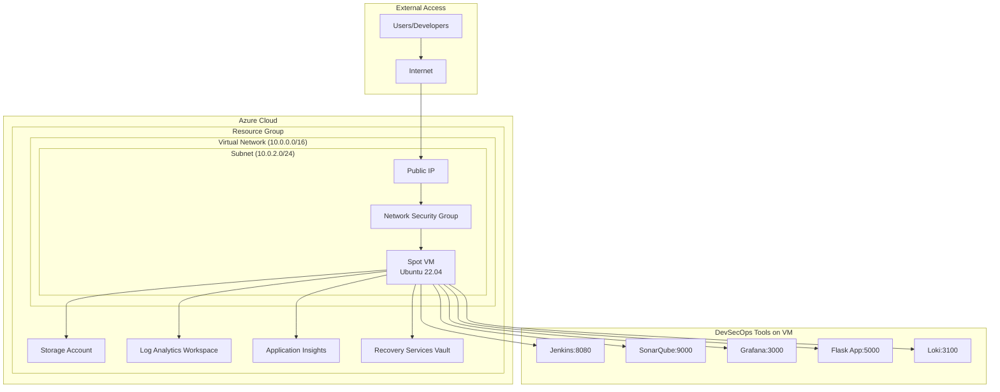

# 🚀 DevSecOps Azure Terraform Infrastructure

[](https://www.terraform.io/)
[](https://azure.microsoft.com/)
[](#features)
[](LICENSE)

Complete Terraform infrastructure for deploying the DevSecOps environment on Azure with cost-optimized Spot instances, integrated monitoring, and automated setup.

## 📋 Table of Contents

- [🎯 Overview](#-overview)
- [✨ Features](#-features)
- [🏗️ Architecture](#️-architecture)
- [📋 Prerequisites](#-prerequisites)
- [⚡ Quick Start](#-quick-start)
- [🔧 Configuration](#-configuration)
- [🚀 Deployment](#-deployment)
- [🔗 Access Services](#-access-services)
- [💰 Cost Management](#-cost-management)
- [🔍 Monitoring](#-monitoring)
- [🧹 Cleanup](#-cleanup)
- [🛠️ Troubleshooting](#️-troubleshooting)

## 🎯 Overview

This Terraform configuration provisions a complete Azure infrastructure for running the DevSecOps environment with:

- **Cost-optimized Spot VMs** with automatic shutdown
- **Integrated security** with NSG rules for DevSecOps tools
- **Monitoring & logging** with Azure Monitor and Log Analytics
- **Automated setup** with cloud-init integration
- **Persistent storage** for data and backups

### 🎪 What This Deploys

| Component | Description | Default Port |
|-----------|-------------|-------------|
| **🐳 Flask Application** | Python web app with health checks | 5000 |
| **🔧 Jenkins** | CI/CD pipeline with custom plugins | 8080 |
| **🔍 SonarQube** | Code quality and security analysis | 9000 |
| **📊 Grafana** | Monitoring dashboards | 3000 |
| **📝 Loki** | Log aggregation | 3100 |
| **🔐 Security Tools** | Trivy, OWASP, vulnerability scanning | - |

## ✨ Features

### 💵 Cost Optimization
- **Azure Spot Instances** - Up to 90% cost savings
- **Auto-shutdown scheduling** - Automatic VM shutdown
- **Resource tagging** - Cost tracking and management
- **Optimized VM sizes** - Right-sized for workload

### 🔒 Security
- **Network Security Groups** - Controlled access to services
- **SSH key-based authentication** - No password access
- **Private networking** - Internal communication secured
- **Firewall rules** - Restricted administrative access

### 📊 Monitoring & Logging
- **Azure Monitor** - VM performance metrics
- **Log Analytics** - Centralized log management
- **Application Insights** - Application performance monitoring
- **Automated data collection** - Performance and security metrics

### 🛠️ Automation
- **Cloud-init integration** - Automated VM setup
- **DevSecOps tools pre-installed** - Docker, kubectl, Helm, Ansible
- **Service auto-configuration** - Ready-to-use CI/CD pipeline
- **Backup configuration** - Automated backup setup

## 🏗️ Architecture



## 📋 Prerequisites

### Required Tools
- **Terraform** >= 1.0
- **Azure CLI** >= 2.30
- **SSH client** (for VM access)

### Azure Requirements
- **Azure subscription** with Contributor access
- **Service Principal** or Azure CLI authentication
- **Resource quota** for chosen VM size

### Installation Commands

```bash
# Install Terraform (Windows)
choco install terraform

# Install Azure CLI (Windows)
choco install azure-cli

# Or download from:
# https://www.terraform.io/downloads
# https://docs.microsoft.com/en-us/cli/azure/install-azure-cli
```

## ⚡ Quick Start

### 1. Clone and Navigate
```bash
cd terraform
```

### 2. Configure Variables
```bash
# Copy example configuration
cp terraform.tfvars.example terraform.tfvars

# Edit with your values
notepad terraform.tfvars
```

### 3. Authenticate with Azure
```bash
# Login to Azure
az login

# Set subscription (if multiple)
az account set --subscription "your-subscription-id"

# Verify authentication
az account show
```

### 4. Deploy Infrastructure
```bash
# Initialize Terraform
terraform init

# Plan deployment
terraform plan

# Apply configuration
terraform apply
```

### 5. Connect to VM
```bash
# Use the output SSH command
ssh -i devsecops-key.pem azureuser@<PUBLIC_IP>

# Check setup status
sudo cloud-init status
```

## 🔧 Configuration

### Essential Variables

Edit `terraform.tfvars`:

```hcl
# Azure Configuration
location = "East US"
environment = "dev"
owner = "Your-Team"

# VM Configuration
vm_size = "Standard_D2s_v3"
admin_username = "azureuser"

# Security - Replace with your IP
admin_ip_cidr = "203.0.113.0/32"  # Your IP/32

# Spot Instance Pricing
max_bid_price = 0.10  # $0.10/hour max

# Cost Management
auto_shutdown_enabled = true
auto_shutdown_time = "2300"  # 11:00 PM
```

### VM Size Recommendations

| Environment | VM Size | vCPUs | RAM | Use Case |
|-------------|---------|-------|-----|----------|
| **Development** | Standard_B2s | 2 | 4GB | Light testing |
| **Standard** | Standard_D2s_v3 | 2 | 8GB | Full DevSecOps |
| **Performance** | Standard_D4s_v3 | 4 | 16GB | Heavy workloads |

### Security Configuration

```hcl
# Restrict SSH access to your IP
admin_ip_cidr = "YOUR_IP/32"

# Check your IP:
# curl ifconfig.me
```

## 🚀 Deployment

### Step-by-Step Deployment

1. **Initialize Terraform**
```bash
terraform init
```

2. **Validate Configuration**
```bash
terraform validate
terraform fmt
```

3. **Plan Deployment**
```bash
terraform plan -out=tfplan
```

4. **Apply Infrastructure**
```bash
terraform apply tfplan
```

5. **Save Outputs**
```bash
terraform output > infrastructure-info.txt
```

### Deployment Timeline

| Phase | Duration | Description |
|-------|----------|-------------|
| **VM Provisioning** | 2-3 minutes | Azure VM creation |
| **Cloud-init Setup** | 5-10 minutes | Tools installation |
| **DevSecOps Setup** | 10-15 minutes | Services deployment |
| **Total** | 15-30 minutes | Complete environment |

## 🔗 Access Services

### Service URLs

After deployment, access services via:

```bash
# Get service URLs
terraform output service_urls

# Example outputs:
# Jenkins:   http://20.121.234.56:8080
# SonarQube: http://20.121.234.56:9000
# Grafana:   http://20.121.234.56:3000
# Flask App: http://20.121.234.56:5000
```

### Using nip.io (Recommended)

```bash
# Get nip.io URLs
terraform output nip_io_urls

# Example outputs:
# Jenkins:   http://jenkins.20.121.234.56.nip.io
# SonarQube: http://sonarqube.20.121.234.56.nip.io
# Grafana:   http://grafana.20.121.234.56.nip.io
# Flask App: http://app.20.121.234.56.nip.io
```

### SSH Access

```bash
# Get SSH command
terraform output ssh_connection_command

# Connect to VM
ssh -i devsecops-key.pem azureuser@<PUBLIC_IP>
```

### Default Credentials

| Service | Username | Password | Notes |
|---------|----------|----------|-------|
| **Jenkins** | admin | *generated* | Check VM logs |
| **SonarQube** | admin | admin | Change on first login |
| **Grafana** | admin | admin123 | Configurable |

## 💰 Cost Management

### Spot Instance Pricing

```hcl
# Current configuration
max_bid_price = 0.10  # $0.10/hour maximum

# Pay-as-you-go (no eviction)
max_bid_price = -1
```

### Check Current Spot Prices

```bash
# Azure CLI command
az vm list-skus --location "East US" --size Standard_D2s_v3 --output table

# PowerShell
az vm list-skus --location "East US" --size Standard_D2s_v3 --query '[].{Name:name, Tier:tier, Size:size, Locations:locations[0]}' --output table
```

### Auto-Shutdown Configuration

```hcl
auto_shutdown_enabled = true
auto_shutdown_time = "2300"  # 11:00 PM
auto_shutdown_timezone = "UTC"
```

### Cost Monitoring

```bash
# View costs by resource group
az consumption usage list --start-date 2024-01-01 --end-date 2024-01-31

# Export billing data
az billing invoice download --invoice-name "your-invoice"
```

## 🔍 Monitoring

### Azure Monitor Integration

The infrastructure automatically configures:

- **Performance metrics** - CPU, memory, disk usage
- **Log collection** - System and application logs
- **Application insights** - Web app performance
- **Backup monitoring** - Automated backup status

### Accessing Monitoring Data

```bash
# Get monitoring workspace ID
terraform output log_analytics_workspace_id

# Get Application Insights key
terraform output application_insights_instrumentation_key
```

### Custom Dashboards

1. **Azure Portal** → Monitor → Dashboards
2. **Grafana** → Import DevSecOps dashboards
3. **Log Analytics** → Custom queries

## 🧹 Cleanup

### Destroy Infrastructure

```bash
# Destroy all resources
terraform destroy

# Confirm destruction
yes
```

### Selective Cleanup

```bash
# Remove specific resources
terraform destroy -target=azurerm_linux_virtual_machine.devsecops
```

### Manual Cleanup

```bash
# List resources
az resource list --resource-group "rg-devsecops-*"

# Delete resource group
az group delete --name "rg-devsecops-*" --yes
```

## 🛠️ Troubleshooting

### Common Issues

#### VM Won't Start
```bash
# Check VM status
az vm show --resource-group "rg-devsecops-*" --name "vm-devsecops-*" --query "powerState"

# Start VM if stopped
az vm start --resource-group "rg-devsecops-*" --name "vm-devsecops-*"
```

#### Can't Connect via SSH
```bash
# Check NSG rules
az network nsg show --resource-group "rg-devsecops-*" --name "nsg-devsecops-*"

# Verify key permissions
chmod 600 devsecops-key.pem
```

#### Services Not Running
```bash
# SSH to VM
ssh -i devsecops-key.pem azureuser@<PUBLIC_IP>

# Check cloud-init logs
sudo cloud-init status
sudo journalctl -u cloud-final

# Check DevSecOps setup
cd Sample-DevSecOps && ./setup.sh
```

#### Spot Instance Evicted
```bash
# Check eviction status
az vm show --resource-group "rg-devsecops-*" --name "vm-devsecops-*" --query "evictionPolicy"

# Increase bid price or use regular VM
max_bid_price = 0.20  # Increase bid
# OR
max_bid_price = -1    # Regular pricing
```

### Debug Commands

```bash
# Terraform debugging
export TF_LOG=DEBUG
terraform apply

# Azure CLI debugging
az vm show --debug --resource-group "rg-devsecops-*" --name "vm-devsecops-*"

# VM serial console
az vm boot-diagnostics get-boot-log --resource-group "rg-devsecops-*" --name "vm-devsecops-*"
```

### Support Resources

- **Azure Support**: [Azure Support Portal](https://portal.azure.com/#blade/Microsoft_Azure_Support/HelpAndSupportBlade)
- **Terraform Issues**: [Terraform GitHub Issues](https://github.com/hashicorp/terraform/issues)
- **Azure Provider**: [AzureRM Provider Issues](https://github.com/terraform-providers/terraform-provider-azurerm/issues)

### Log Files

```bash
# VM setup logs
/home/azureuser/terraform-setup.log

# Cloud-init logs
/var/log/cloud-init.log
/var/log/cloud-init-output.log

# DevSecOps logs
/tmp/devsecops-setup.log
```

## 📚 Additional Resources

- [Azure Spot VMs Documentation](https://docs.microsoft.com/en-us/azure/virtual-machines/spot-vms)
- [Terraform Azure Provider](https://registry.terraform.io/providers/hashicorp/azurerm/latest)
- [DevSecOps Project Documentation](../PROJECT_DOCUMENTATION.md)
- [Azure Cost Management](https://docs.microsoft.com/en-us/azure/cost-management-billing/)

---

**Happy DevSecOps! 🚀**

For questions or support, please check the troubleshooting section or contact the DevSecOps team.
